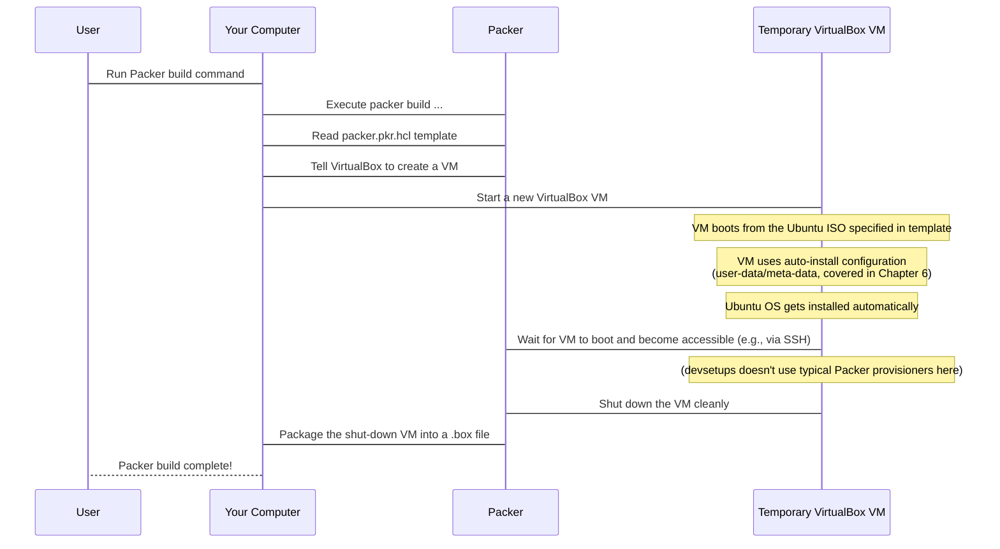

# Chapter 2: Packer

Welcome back! In [Chapter 1: Bootstrap Script](01_bootstrap_script_.md), we learned how a single script can kickstart the setup process on a machine, ensuring you have the basic tools (like Git and Ansible) and the project code ready to go. But what if you need to do this setup on many different machines, or even many *virtual* machines? Manually installing the operating system (OS) each time, and then running the bootstrap script, can still be slow and inconsistent.

Imagine you're a baker and you need to make hundreds of identical cookies. You wouldn't bake each one from scratch, carefully shaping every single cookie dough piece by hand, right? You'd use a **cookie cutter**!

## What is Packer?

**Packer** is like a "cookie cutter" for creating virtual machine images. Its main job is to build **identical machine images** for different platforms (like VirtualBox, VMware, cloud providers like AWS, etc.) from a single instruction file.

In the `devsetups` project, Packer is used to build the base **`ubuntu-dev`** virtual machine image. This is the fundamental operating system setup that [Vagrant](03_vagrant_.md) will later use as the starting point for creating new development environments.

Using Packer ensures that every time you spin up a new `ubuntu-dev` VM, it starts from *exactly* the same foundational state. This saves a lot of time compared to installing an OS manually and running initial setup steps yourself. It also guarantees consistency, reducing those "it worked on my machine!" problems caused by slightly different starting points.

## Packer's Role in `devsetups`

Before you can use [Vagrant](03_vagrant_.md) to quickly create and manage virtual machines, you need a pre-built image for Vagrant to use. Packer is the tool that creates this image file (specifically, a `.box` file compatible with Vagrant) for the `ubuntu-dev` environment.

Think of the flow like this:

1.  **Packer:** Builds the base `ubuntu-dev` image (the "cookie dough" + initial "cut").
2.  **Vagrant:** Uses the `ubuntu-dev` image to quickly create new VMs (bakes and produces many identical cookies).
3.  **Bootstrap Script & Ansible:** Run *inside* the new VM to add project-specific tools and configuration (add the "frosting" and "sprinkles").

Packer handles step 1, ensuring the "dough" is always prepared in the same way.

## How Does Packer Work (Simply)?

Packer uses a configuration file, called a **template** (`packer.pkr.hcl` in our project), to understand how to build an image.

Here's a simplified look at what happens when Packer builds our `ubuntu-dev` image:



In essence:

1.  You tell Packer to build using a specific template file.
2.  Packer reads the template, which tells it:
    *   Which **platform** to build for (e.g., VirtualBox).
    *   Which **installer media** to use (e.g., an Ubuntu ISO file).
    *   How to **automate the OS installation** (in `devsetups`, this involves specific boot commands and files like `user-data` for Ubuntu's auto-install feature - more on this in [Chapter 6: Ubuntu Auto-install (Cloud-init)](06_ubuntu_auto_install__cloud_init__.md)).
    *   How to **package the final image** (e.g., convert the VirtualBox VM into a `.box` file for [Vagrant](03_vagrant_.md)).
3.  Packer starts a **temporary virtual machine** on your computer using the specified platform (VirtualBox).
4.  It guides the temporary VM through the automated OS installation process.
5.  Once the OS is installed and configured according to the template (including setup via the auto-install files), Packer shuts down the temporary VM.
6.  Finally, Packer takes the disk image of the temporary VM and packages it into the desired output format (our `.box` file).

The temporary VM is then discarded by Packer; you only keep the final packaged image.

## Using Packer in `devsetups`

In `devsetups`, you typically don't run Packer directly. Instead, the `ubuntu-autoinstall/bootstrap.sh` script handles running Packer for you.

Remember the `ubuntu-autoinstall/bootstrap.sh` script we saw glimpses of in Chapter 1? Besides generating necessary configuration files like `user-data`, it contains the command to run Packer.

Here's the relevant snippet from `ubuntu-autoinstall/bootstrap.sh`:

```bash
# ... (previous steps like generating user-data and SSH key) ...

# Step 4: Run Packer
echo "[+] Running Packer build..."
packer build \
  -var "box_name=$box_name" \
  -var "cpus=$cpus" \
  -var "memory=$memory" \
  -var "disk_size=$disk_size" \
  packer.pkr.hcl

# Step 5: Add the box to Vagrant
echo "[+] Adding the built box to Vagrant..."
vagrant box add --name "$box_name" "output/${box_name}.box" --force

# ... (rest of the script) ...
```

When you run `./ubuntu-autoinstall/bootstrap.sh`, this part of the script executes:

*   It runs the command `packer build packer.pkr.hcl`.
*   It passes some information (like the desired box name, CPU cores, memory, and disk size) to Packer using `-var` flags. These values come from the answers you provide when the script prompts you.
*   Packer then starts building the image based on the instructions in the `packer.pkr.hcl` file, using the variables provided.
*   Once Packer successfully builds the `.box` file (which ends up in the `./output` directory), the script automatically adds this newly created box to your local [Vagrant](03_vagrant_.md) environment using `vagrant box add`.

This means running `./ubuntu-autoinstall/bootstrap.sh` not only *builds* the image using Packer but also makes it immediately available for [Vagrant](03_vagrant_.md) to use.

## The Packer Template (`packer.pkr.hcl`)

The brain behind the Packer build process is the template file, `ubuntu-autoinstall/packer.pkr.hcl`. This file, written in HashiCorp Configuration Language (HCL), contains all the instructions Packer needs.

While we'll dive deeper into this file in [Chapter 5: Packer Template (packer.pkr.hcl)](05_packer_template__packer_pkr_hcl__.md), here's a peek at its structure to see where Packer gets its instructions:

```hcl
packer {
  # Specifies required plugins (like VirtualBox)
  # ...
}

variable "iso_url" {
  # Defines variables like where to find the OS installation ISO
  # ...
}

source "virtualbox-iso" "ubuntu" {
  # This is a 'builder' block
  # Tells Packer how to start the temporary VM using a VirtualBox ISO
  guest_os_type    = "Ubuntu_64"
  iso_url          = var.iso_url
  # ... VM settings (cpus, memory, disk, etc.) ...
  # ... How to boot the VM and start auto-install (boot_command) ...
  # ... Where to find auto-install files (cd_files -> user-data, meta-data) ...
  # ... How to connect (ssh) ...
}

build {
  # This block defines the build process
  sources = ["source.virtualbox-iso.ubuntu"] # Use the builder defined above

  post-processor "vagrant" {
    # This is a 'post-processor'
    # Tells Packer to package the final image as a Vagrant .box file
    output = "output/${var.box_name}.box"
  }
}
```

*This simplified snippet from `packer.pkr.hcl` shows the main parts: defining plugins/variables, configuring how to build a VirtualBox VM from an ISO (`source`), and how to package the result (`build` with a `post-processor`).*

The `source` block tells Packer *how* to create and configure the temporary VM, including pointing it to the OS installation media and the files needed for automated setup ([user-data/meta-data](06_ubuntu_auto_install__cloud_init__.md)). The `build` block tells Packer which `source` to use and what to do *after* the VM is built (like running the `vagrant` post-processor to create the `.box` file).

## Conclusion

Packer is a powerful tool that brings consistency to the start of your development environment setup. By creating a standard, reusable `ubuntu-dev` base image, it ensures that no matter how many virtual machines you create with [Vagrant](03_vagrant_.md), they all begin from the exact same foundation. This foundation is built automatically using the instructions in the `packer.pkr.hcl` template and leverages Ubuntu's auto-install feature (covered in [Chapter 6](06_ubuntu_auto_install__cloud_init__.md)) for hands-off OS installation.

Now that you know how the consistent base image is built by Packer, the next logical step is to understand how you *use* that image to quickly spin up new virtual machines. That's where [Vagrant](03_vagrant_.md) comes in.

[Chapter 3: Vagrant](03_vagrant_.md)

---

<sub><sup>Generated by [AI Codebase Knowledge Builder](https://github.com/The-Pocket/Tutorial-Codebase-Knowledge).</sup></sub> <sub><sup>**References**: [[1]](https://github.com/arslan-qamar/devsetups/blob/cd5cb98b078b41c16f6bd228f33880ad55b52475/roles/packer/README), [[2]](https://github.com/arslan-qamar/devsetups/blob/cd5cb98b078b41c16f6bd228f33880ad55b52475/roles/packer/tasks/main.yml), [[3]](https://github.com/arslan-qamar/devsetups/blob/cd5cb98b078b41c16f6bd228f33880ad55b52475/ubuntu-autoinstall/README.md), [[4]](https://github.com/arslan-qamar/devsetups/blob/cd5cb98b078b41c16f6bd228f33880ad55b52475/ubuntu-autoinstall/bootstrap.sh), [[5]](https://github.com/arslan-qamar/devsetups/blob/cd5cb98b078b41c16f6bd228f33880ad55b52475/ubuntu-autoinstall/packer.pkr.hcl)</sup></sub>