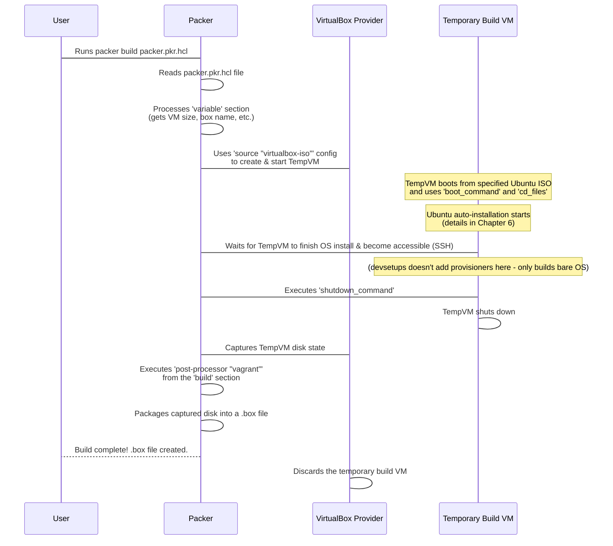

# Chapter 5: Packer Template (packer.pkr.hcl)

Welcome back! In our journey so far, we've learned about the [Bootstrap Script](01_bootstrap_script_.md) (the initial kickstarter), [Packer](02_packer_.md) (the tool for building consistent base images), [Vagrant](03_vagrant_.md) (the tool for spinning up VMs from those images), and [Ansible](04_ansible_.md) (the tool for configuring the software inside the VMs).

In [Chapter 2: Packer](02_packer_.md), we introduced Packer as the "cookie cutter" for creating identical virtual machine images. But how does Packer know *what* kind of cookie cutter to be? How does it know which operating system to install, how much memory and CPU the temporary build VM should have, or what format the final image should be in?

This is all defined in the **Packer Template** file, specifically `packer.pkr.hcl` in the `devsetups` project. It's the detailed **recipe** that Packer follows to bake our base `ubuntu-dev` VM image.

## What is `packer.pkr.hcl`?

The `packer.pkr.hcl` file is the main configuration file for Packer. It tells Packer step-by-step how to build a machine image. It's written in **HCL (HashiCorp Configuration Language)**, which is designed to be easy for humans to read and write, but structured enough for a machine to understand.

Think of it as the blueprint or instruction manual for Packer. It answers questions like:

*   Where do I get the operating system installation files?
*   What virtualization software should I use to build this (like VirtualBox)?
*   How should the temporary build VM be configured (CPU, memory, disk)?
*   How do I automate the operating system installation?
*   What should I do *after* the OS is installed (like packaging the image)?

## Key Sections of the Packer Template

The `packer.pkr.hcl` file is structured into several main blocks or sections. Let's look at the most important ones for understanding how our `ubuntu-dev` box is built:

| Section          | What it does                                                    | Analogy                                     |
| :--------------- | :-------------------------------------------------------------- | :------------------------------------------ |
| `packer`         | Defines global settings, like required plugins.                 | Listing the main tools needed (oven type).  |
| `variable`       | Defines values that can be customized (like ISO URL, VM size).  | Ingredients list with placeholders (e.g., "X cups of flour"). |
| `source`         | Describes *how* to create the base machine/VM using a builder (e.g., from a VirtualBox ISO). This is where OS installation details live. | The steps for mixing ingredients and preparing the dough. |
| `build`          | Defines the overall build process, including which `source` to use and what steps to take *after* the source is built. | The overall baking process steps.           |
| `post-processor` | Defines steps to run *after* the main build, like converting the image to a different format (e.g., a Vagrant `.box`). | The finishing touches and packaging steps.  |

In our `devsetups` project, `packer.pkr.hcl` uses a `source` block of type `virtualbox-iso` to build a VirtualBox VM from an Ubuntu ISO file.

## How the Template Builds the `ubuntu-dev` Box

Let's see how `packer.pkr.hcl` guides Packer, referencing pieces of the actual file (simplified for clarity).

Remember from [Chapter 2](02_packer_.md) that you run `./ubuntu-autoinstall/bootstrap.sh`, which then runs the `packer build packer.pkr.hcl` command? When Packer executes this command, it reads the `packer.pkr.hcl` file and performs the following high-level steps:



Let's look at the specific instructions in the `packer.pkr.hcl` file that enable this process:

### 1. Defining Customizable Values (`variable` block)

The `packer.pkr.hcl` file uses `variable` blocks to define values that might change, like the location of the Ubuntu ISO file, the desired VM size, or the name of the output box.

```hcl
variable "iso_url" {
  type    = string
  default = "file:///media/arslan/Ubuntu Data/ISO/ubuntu-24.04.2-desktop-amd64.iso"
  # This default might point to a local file
}

variable "box_name" {
  type    = string
  default = "ubuntu-dev"
  # The name Packer will use for the output file and Vagrant box
}

variable "cpus" {
  type    = number
  default = 10
  # Default number of CPU cores for the build VM
}

variable "memory" {
  type    = number
  default = 8196 # 8GB
  # Default RAM in MB for the build VM
}

// ... other variables ...
```

*This snippet shows how variables are defined. The `default` value is used unless overridden when running the `packer build` command (which `./ubuntu-autoinstall/bootstrap.sh` does using the `-var` flags).*

These variables allow the `./ubuntu-autoinstall/bootstrap.sh` script (or you, if running Packer manually) to customize the build without changing the main template file.

### 2. Configuring the Build VM (`source "virtualbox-iso" "ubuntu"` block)

This is the largest and most detailed section. The `source` block tells Packer how to start and interact with the temporary VM it uses for building.

```hcl
source "virtualbox-iso" "ubuntu" {
  guest_os_type    = "Ubuntu_64" # What OS is expected
  iso_url          = var.iso_url # Get ISO path from the variable
  iso_checksum     = var.iso_checksum # Verify the ISO file

  communicator = "ssh" # How Packer talks to the VM after boot
  ssh_username = "ubuntu" # Default user on the installed OS
  ssh_private_key_file = "./vagrant_custom_key" # SSH key to use
  ssh_timeout  = "20m" # How long to wait for SSH connection

  cpus       = var.cpus # Get CPU count from variable
  memory     = var.memory # Get memory from variable
  disk_size  = var.disk_size # Get disk size from variable
  // ... other VirtualBox specific settings (vboxmanage) ...

  boot_wait  = "10s" # Wait a bit after boot
  boot_command = [
    "c", "<wait3s>", // Press 'c' to get to GRUB command line
    "linux /casper/vmlinuz --- autoinstall ds=nocloud", "<enter><wait3s>", // Load kernel with auto-install params
    "initrd /casper/initrd", "<enter><wait3s>", // Load initrd
    "boot", "<enter>" // Start the boot process
  ]

  cd_files  = ["./meta-data", "./user-data"] # Files to attach as a CD-ROM
  cd_label  = "cidata" # Label for the CD-ROM (required by cloud-init)

  headless  = false // Set to true if you don't want to see the VM window
}
```

*This snippet highlights key parts of the `source` block.*

*   `guest_os_type`, `iso_url`, `iso_checksum`: Tells Packer *what* to install (a 64-bit Ubuntu) and *where* to find the installer files.
*   `communicator`, `ssh_username`, `ssh_private_key_file`, `ssh_timeout`: Configures how Packer connects to the VM *after* the operating system has been installed and is booting up. This is typically SSH, and it uses the SSH key generated by `ubuntu-autoinstall/bootstrap.sh`.
*   `cpus`, `memory`, `disk_size`: Sets the hardware specifications for the temporary VM that Packer creates for the build process, pulling values from the `variable` block.
*   `boot_command`: This is crucial! It's a sequence of keystrokes sent to the VM console right after it boots from the ISO. These specific commands tell the Ubuntu installer to start in **auto-install** mode and look for configuration files using the `ds=nocloud` parameter. We'll explore the auto-install configuration files (`user-data`, `meta-data`) in [Chapter 6](06_ubuntu_auto_install__cloud_init__.md).
*   `cd_files`, `cd_label`: These lines tell Packer to attach the `user-data` and `meta-data` files (which are generated by `ubuntu-autoinstall/bootstrap.sh`) as a virtual CD-ROM labeled `cidata`. The Ubuntu installer, when in `autoinstall ds=nocloud` mode, automatically looks for a CD-ROM with this label containing these files to get its installation instructions. This is the link between Packer and the Ubuntu auto-installation feature.

So, the `source` block defines the temporary VM's hardware and networking, tells Packer how to access it, points to the OS installer, and most importantly, provides the commands and configuration files needed to automate the OS installation itself.

### 3. Packaging the Result (`build` block with `post-processor`)

After the temporary VM has finished installing the OS, shut down, and its disk state captured, the `build` block specifies what to do next. In our case, we use the `vagrant` post-processor.

```hcl
build {
  sources = ["source.virtualbox-iso.ubuntu"] // Use the builder defined above

  post-processor "vagrant" {
    // Tells Packer to package the final image as a Vagrant .box file
    output = "output/${var.box_name}.box" // Name the output file using the variable
  }
}
```

*This snippet shows the `build` block.*

*   `sources = ["source.virtualbox-iso.ubuntu"]`: This line links the `build` process to the specific `source` block defined earlier. It tells Packer, "Use the VM image produced by the `virtualbox-iso.ubuntu` source."
*   `post-processor "vagrant"`: This tells Packer to run a specific process *after* the source build is complete. The `vagrant` post-processor takes the VM image built by the source and packages it into a format that [Vagrant](03_vagrant_.md) can easily use (`.box` file).
*   `output = "output/${var.box_name}.box"`: This specifies the name and location for the final Vagrant box file, again using the `box_name` variable defined earlier.

## Conclusion

The `packer.pkr.hcl` file is the master recipe for building our consistent `ubuntu-dev` base virtual machine image. It uses HashiCorp Configuration Language to define variables, configure the temporary build VM (using a `virtualbox-iso` source), specify how to automate the OS installation via boot commands and configuration files, and finally, package the result into a Vagrant `.box` file using a `post-processor`.

Understanding this file helps you see how Packer takes raw materials (an ISO) and turns them into a reusable base image. Crucially, you've seen how the `boot_command` and `cd_files` settings point to the files that automate the *actual* operating system installation. In the next chapter, we'll lift the lid on those files (`user-data` and `meta-data`) and understand how Ubuntu performs a hands-off, automatic installation using a feature called Cloud-init.

[Chapter 6: Ubuntu Auto-install (Cloud-init)](06_ubuntu_auto_install__cloud_init__.md)

---

<sub><sup>Generated by [AI Codebase Knowledge Builder](https://github.com/The-Pocket/Tutorial-Codebase-Knowledge).</sup></sub> <sub><sup>**References**: [[1]](https://github.com/arslan-qamar/devsetups/blob/cd5cb98b078b41c16f6bd228f33880ad55b52475/ubuntu-autoinstall/README.md), [[2]](https://github.com/arslan-qamar/devsetups/blob/cd5cb98b078b41c16f6bd228f33880ad55b52475/ubuntu-autoinstall/bootstrap.sh), [[3]](https://github.com/arslan-qamar/devsetups/blob/cd5cb98b078b41c16f6bd228f33880ad55b52475/ubuntu-autoinstall/packer.pkr.hcl)</sup></sub>