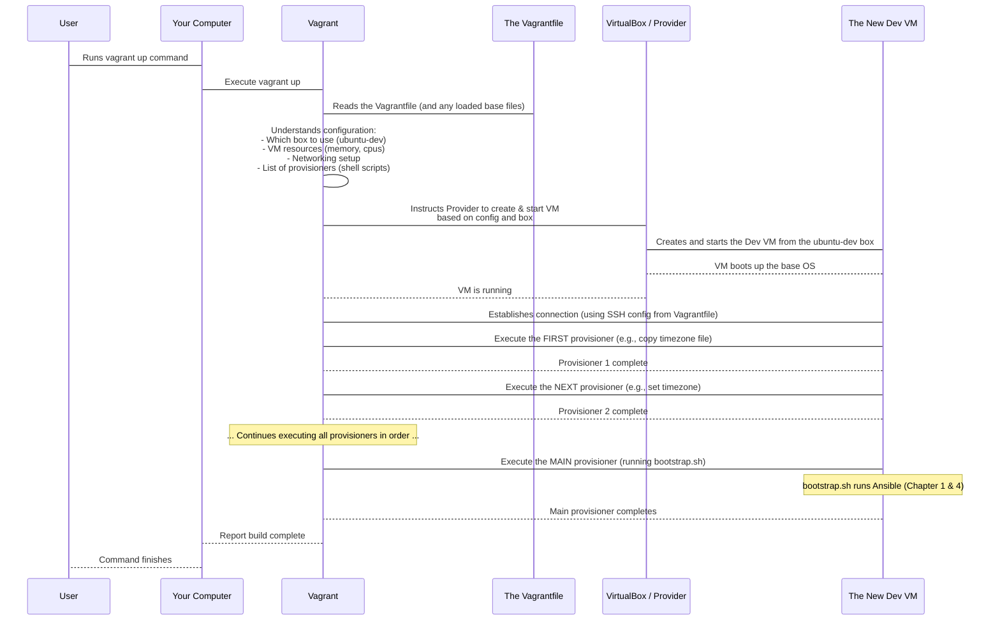

# Chapter 7: Vagrantfile

Welcome back! We've covered a lot of ground. We know how the [Bootstrap Script](01_bootstrap_script_.md) gets the very first tools installed, how [Packer](02_packer_.md) creates consistent base operating system images using a detailed [Packer Template (packer.pkr.hcl)](05_packer_template__packer_pkr_hcl__.md) and [Ubuntu Auto-install (Cloud-init)](06_ubuntu_auto_install__cloud_init__.md), and how [Vagrant](03_vagrant_.md) uses those images to quickly spin up virtual machines. We also know that [Ansible](04_ansible_.md) is the tool that does the heavy lifting of installing software and configuring the environment *inside* those machines.

But how does [Vagrant](03_vagrant_.md) know *which* base image to use, how much memory the VM should have, or *what* setup scripts to run after the VM starts? Where is all this information stored and organized for a specific project or environment?

This is the job of the **Vagrantfile**. It's the central control panel and blueprint for a specific Vagrant environment.

## What is a Vagrantfile?

A `Vagrantfile` is a configuration file, typically written using a simple syntax based on the Ruby programming language. Don't worry, you **do not** need to know Ruby to understand or use a `Vagrantfile`! The syntax is designed to be very readable and straightforward, primarily using `config.vm.something = value` lines.

Think of the `Vagrantfile` as the **blueprint** for your virtual machine development environment. It lives in the root directory of your project (or a dedicated directory for the environment) and tells Vagrant everything it needs to know to create and configure the VM.

Each directory containing a `Vagrantfile` is considered a separate Vagrant environment. This means you can have different `Vagrantfile`s in different project folders, each describing a unique VM setup tailored for that specific project.

Here's what the `Vagrantfile` typically defines:

*   **The base box:** Which OS image ([Packer](02_packer_.md)'s `ubuntu-dev.box`, for example) should Vagrant start from?
*   **VM settings:** How many CPUs, how much memory, what kind of disk space should the VM have?
*   **Networking:** How should your host computer connect to the VM? (e.g., shared folders, port forwarding, network interfaces).
*   **Provisioning:** What commands or scripts should be run *inside* the VM after it boots up to install software and configure the environment? (This is where [Ansible](04_ansible_.md) comes in, often triggered by our [Bootstrap Script](01_bootstrap_script_.md)).

## The Core Use Case: Defining and Starting Your Environment

The main use case for a `Vagrantfile` is to define your desired environment and then use the simple `vagrant up` command to make it happen.

For example, in the `devsetups` project, if you want to set up the `ibkr` environment (designed for working with the Interactive Brokers API, as hinted by the folder name), you go to the `ibkr` directory and find its `Vagrantfile`.

```bash
# 1. Navigate to the specific environment directory
cd ibkr/

# 2. Now you are in the directory with the Vagrantfile

# 3. Run the command to build and start the environment
vagrant up
```

When you run `vagrant up` in the `ibkr` directory, Vagrant automatically looks for the `Vagrantfile` in that directory and follows its instructions. This is the magic: the `Vagrantfile` makes the process of creating a complex environment as simple as running one command.

## Key Configuration Lines in a Vagrantfile

Let's look at the structure of a typical `Vagrantfile` and the key lines you'll see. `devsetups` uses a base file (`ubuntu-autoinstall/vagrant-base/Vagrantfile.base`) and then loads it into specific environment `Vagrantfile`s (like `ibkr/Vagrantfile`). This is a good practice to avoid repeating common settings.

First, let's look at the base settings in `ubuntu-autoinstall/vagrant-base/Vagrantfile.base`:

```ruby
# -*- mode: ruby -*-
# vi: set ft=ruby :

# Main Vagrant configuration block
Vagrant.configure("2") do |config|
  # Tells Vagrant which box (base image) to use.
  # We use the box built by Packer.
  config.vm.box = "ubuntu-dev"

  # Configure SSH access to the VM
  config.ssh.username = "ubuntu"
  # Point Vagrant to the private SSH key needed to connect
  config.ssh.private_key_path = [ENV.fetch('VAGRANT_CUSTOM_KEY_PATH', '../vagrant_custom_key')]
  config.ssh.insert_key = false # Don't force Vagrant's default key

  # Configure networking - bridge to your host's network interface
  default_interface = `ip route get 8.8.8.8 | grep -oP 'dev \\K\\S+'`.strip
  config.vm.network "public_network", bridge: default_interface

  # --- PROVISIONING STEPS START HERE ---

  # Provisioner 1: Copy timezone file from host to VM
  config.vm.provision "file", source: "/etc/timezone", destination: "/tmp/host-timezone"

  # Provisioner 2: Set timezone inside the VM
  config.vm.provision "shell", inline: <<-SHELL
    set -e
    echo "Setting timezone..."
    sudo cp /tmp/host-timezone /etc/timezone
    sudo ln -sf /usr/share/zoneinfo/$(cat /etc/timezone) /etc/localtime
    sudo dpkg-reconfigure -f noninteractive tzdata
  SHELL

  # Provisioner 3 & 4: Install VirtualBox Guest Additions (important for shared folders, performance, etc.)
  # This involves copying the ISO and running the installer script inside the VM
  # ... (Guest Additions code omitted for brevity, but shown in original base file) ...

  # --- PROVISIONING STEPS END HERE ---
end
```
*This simplified snippet from `Vagrantfile.base` shows fundamental configuration lines. It sets the box, SSH details, networking, and defines initial shell provisioners to configure the VM right after it boots.*

Let's break down the key lines within the `Vagrant.configure("2") do |config| ... end` block:

*   `config.vm.box = "ubuntu-dev"`: This is crucial. It tells Vagrant to use the "ubuntu-dev" base image that we built with [Packer](02_packer_.md) and added to Vagrant using `vagrant box add`. If this box isn't available, `vagrant up` will fail.
*   `config.ssh....`: These lines configure how Vagrant connects to the VM via SSH. It specifies the default user (`ubuntu`) and tells Vagrant to use the specific SSH key (`vagrant_custom_key`) that was generated during the [Ubuntu Auto-install](06_ubuntu_auto_install__cloud_init__.md) process when the box was built. This ensures Vagrant can log in automatically.
*   `config.vm.network "public_network", bridge: default_interface`: This sets up networking. `public_network` typically connects the VM to your local network just like your host machine, getting its own IP address. This allows other devices on your network (or the internet, depending on your setup) to potentially reach the VM, and for the VM to access the internet. The `bridge: default_interface` part tells Vagrant which of your computer's network connections to use for this bridge.
*   `config.vm.provision "shell", ...`: These are **provisioners**. They tell Vagrant to run specific commands or scripts *inside* the VM *after* it has booted.
    *   `"shell"`: Specifies we are running shell commands.
    *   `inline: <<-SHELL ... SHELL`: This is a common Ruby syntax to define a multi-line string. Everything between `<<-SHELL` and the closing `SHELL` is treated as a single script to run inside the VM.
    *   The shell scripts here perform initial setup like copying the timezone from your host machine and setting it inside the VM, and installing VirtualBox Guest Additions (which improve integration between the host and VM).

Now, let's look at the specific `ibkr/Vagrantfile`:

```ruby
# -*- mode: ruby -*-
# vi: set ft=ruby :

# Set an environment variable pointing to the custom SSH key path
ENV['VAGRANT_CUSTOM_KEY_PATH'] ||= '../ubuntu-autoinstall/vagrant_custom_key'

# Load the base Vagrantfile settings first
load File.expand_path("../ubuntu-autoinstall/vagrant-base/Vagrantfile.base", __dir__)

# Now, configure things specific to *this* environment (ibkr)
Vagrant.configure("2") do |config|
  # We already set the box in the base, but we can keep it here for clarity
  config.vm.box = "ubuntu-dev"

  # Define a shell provisioner for the main setup
  # This runs *after* the provisioners in the base file
  config.vm.provision "shell", privileged: false, inline: <<-SHELL
    set -e
    echo "Downloading and running bootstrap..."
    # This line runs the main devsetups setup script inside the VM!
    wget --header="Cache-Control: no-cache" -qO- "https://raw.githubusercontent.com/arslan-qamar/devsetups/refs/heads/main/bootstrap.sh?ts=$(date +%s)" | bash -s "main.yml" "localhost," "local" "install" "deps,devbox,docker,githubcli,vscode,zsh,dotnet,hcp"

    # --- Project Specific Setup ---
    # These commands run AFTER the main devsetups setup completes

    # Copy the SSH key used by the host to the VM's ~/.ssh for git operations
    echo "Setting up Host SSH key for git clone..."
    # ... (commands to copy and set permissions on SSH key - see full file) ...

    # Clone the project code (if not already present)
    if [ ! -d "interactivebrokers2" ]; then
      GIT_SSH_COMMAND="ssh -o StrictHostKeyChecking=no" git clone git@github.com:arslan-qamar/interactivebrokers2.git
      cd interactivebrokers2
      # Get secrets using hcp (HashiCorp Cloud Platform) secrets
      echo 'export ibkr_db_paper='$(hcp vault-secrets secrets open ibkr_db_paper | sed -n 's/^Value: *//p') >> .envrc
      # ... (other secrets) ...
    fi

    # Configure git signing
    git config --global commit.gpgsign true
    # ... (other git config - see full file) ...

    # Download and install TWS (Interactive Brokers trading software)
    wget https://download2.interactivebrokers.com/installers/tws/latest-standalone/tws-latest-standalone-linux-x64.sh && chmod +x tws-latest-standalone-linux-x64.sh && ./tws-latest-standalone-linux-x64.sh -q

  SHELL

  # Add VirtualBox-specific customizations for THIS environment
  config.vm.provider "virtualbox" do |vb|
    vb.gui = true # Show the VM window
    vb.memory = "16384" # Override base memory to 16GB for this environment
  end

end
```
*This snippet from `ibkr/Vagrantfile` shows how it loads the base configuration and then adds environment-specific settings and provisioning steps.*

*   `load File.expand_path("../ubuntu-autoinstall/vagrant-base/Vagrantfile.base", __dir__)`: This line loads all the configurations from the base file first. This is how the `ibkr/Vagrantfile` inherits the box name, SSH settings, networking, and initial provisioners defined in the base.
*   `config.vm.provision "shell", ...`: This is another shell provisioner, specific to the `ibkr` environment. **Crucially, this is where the main [Bootstrap Script](01_bootstrap_script_.md) command is run!**
    *   `wget ... | bash -s ...`: This is the exact same command we saw in [Chapter 1: Bootstrap Script](01_bootstrap_script_.md). It downloads the script from GitHub and runs it inside the VM.
    *   The arguments passed (`"main.yml"`, `"localhost,"`, etc.) tell the bootstrap script to run the main [Ansible](04_ansible_.md) playbook with specific tags (`deps,devbox,docker,githubcli,vscode,zsh,dotnet,hcp`). This is how all the core `devsetups` tools (Docker, VS Code, .NET, etc.) get installed *inside* the Vagrant VM.
    *   Below the bootstrap command are additional shell commands specific to the `ibkr` environment, like cloning the project code, setting up git, and installing TWS. These run *after* the main `devsetups` Ansible setup is complete.
*   `config.vm.provider "virtualbox" do |vb| ... end`: This block allows you to configure settings specific to the virtualization provider being used (in this case, VirtualBox). Here, it's used to enable the GUI (`vb.gui = true`) so you can see the VM window and override the default memory set in the base file (`vb.memory = "16384"`).

So, the `Vagrantfile` acts as a layered configuration. The base file provides common settings and initial setup, and the environment-specific file (like `ibkr/Vagrantfile`) loads the base and adds its own customizations and the core provisioning command that kicks off the main [devsetups setup via the Bootstrap Script](01_bootstrap_script_.md) and [Ansible](04_ansible_.md).

## How `vagrant up` Uses the Vagrantfile (Under the Hood)

When you run `vagrant up` in a directory containing a `Vagrantfile`, here's a simplified sequence of events:



The `Vagrantfile` provides the entire script that Vagrant follows. It dictates the base environment, how the VM should be configured, and crucially, what setup steps (provisioning) to execute *inside* the VM to turn that base OS into a fully configured development machine.

## Conclusion

The `Vagrantfile` is the cornerstone of a Vagrant environment. It's a simple, readable file that serves as the blueprint, defining the virtual machine's characteristics and the automated steps needed to configure it. By placing a `Vagrantfile` in a directory and running `vagrant up`, you instruct Vagrant to read this blueprint, create the VM using the specified base box (built by [Packer](02_packer_.md) with [Ubuntu Auto-install](06_ubuntu_auto_install__cloud_init__.md)), and execute the defined provisioners. In `devsetups`, the most important provisioner is the one that runs the [Bootstrap Script](01_bootstrap_script_.md), which in turn uses [Ansible](04_ansible_.md) to install and configure all your development tools.

You now understand how the `Vagrantfile` orchestrates the creation and initial setup of your development environment. The next step is to look deeper into how [Ansible](04_ansible_.md), triggered by this process, organizes its configuration steps into reusable bundles called [Ansible Roles](08_ansible_roles_.md).

[Chapter 8: Ansible Roles](08_ansible_roles_.md)

---

<sub><sup>Generated by [AI Codebase Knowledge Builder](https://github.com/The-Pocket/Tutorial-Codebase-Knowledge).</sup></sub> <sub><sup>**References**: [[1]](https://github.com/arslan-qamar/devsetups/blob/cd5cb98b078b41c16f6bd228f33880ad55b52475/ibkr/Vagrantfile), [[2]](https://github.com/arslan-qamar/devsetups/blob/cd5cb98b078b41c16f6bd228f33880ad55b52475/ibkr/replica/Vagrantfile), [[3]](https://github.com/arslan-qamar/devsetups/blob/cd5cb98b078b41c16f6bd228f33880ad55b52475/ubuntu-autoinstall/vagrant-base/Vagrantfile), [[4]](https://github.com/arslan-qamar/devsetups/blob/cd5cb98b078b41c16f6bd228f33880ad55b52475/ubuntu-autoinstall/vagrant-base/Vagrantfile.base)</sup></sub>