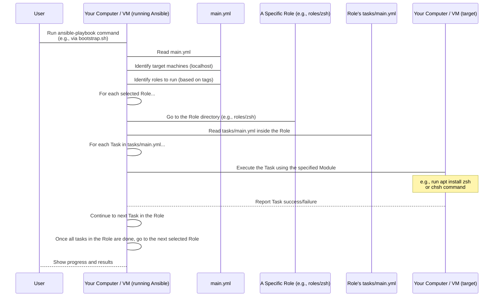

# Chapter 8: Ansible Roles

Welcome back! In our previous chapters, we've learned how the [Bootstrap Script](01_bootstrap_script_.md) gets the ball rolling, how [Packer](02_packer_.md) builds consistent base images using [Ubuntu Auto-install (Cloud-init)](06_ubuntu_auto_install__cloud_init__.md) guided by the [Packer Template (packer.pkr.hcl)](05_packer_template__packer_pkr_hcl__.md), and how [Vagrant](03_vagrant_.md) uses those images with a [Vagrantfile](07_vagrantfile_.md) to spin up virtual machines. We also know that [Ansible](04_ansible_.md) is the powerful tool that actually performs the software installation and configuration *inside* the target machine (whether it's your host or a Vagrant VM).

You might remember from [Chapter 4: Ansible](04_ansible_.md) that Ansible uses instructions written in **Playbooks** (`main.yml`). These playbooks contain a list of **Tasks** to perform.

But think about the `devsetups` project – it needs to set up *many* different tools and configurations: Docker, VS Code, Zsh, .NET, Git settings, and more. If the `main.yml` playbook had to list every single task for *everything* in one long file, it would become incredibly long, hard to read, and difficult to manage. How do we keep this organized?

This is where **Ansible Roles** come in.

## What are Ansible Roles?

Ansible Roles are the standard way to **organize** related Ansible tasks, variables, files, and other resources into **reusable, self-contained units**.

Think of each role as a specialized **"toolbox"** or a **"specialist"** dedicated to setting up one specific thing.

*   Need to set up Docker? There's a `docker` role (the Docker specialist toolbox).
*   Need to configure the Zsh shell? There's a `zsh` role (the Zsh specialist toolbox).
*   Need to install VS Code? There's a `vscode` role (the VS Code specialist toolbox).

Each role contains *all* the steps, configuration files, and variables needed to achieve its specific goal.

In the `devsetups` project, you'll find these toolboxes neatly organized in the `roles/` directory:

```
devsetups/
├── roles/
│   ├── docker/          <-- The 'docker' role lives here
│   │   └── tasks/
│   │       └── main.yml <-- Docker setup tasks
│   ├── vscode/          <-- The 'vscode' role lives here
│   │   └── tasks/
│   │       └── main.yml <-- VS Code setup tasks
│   ├── zsh/             <-- The 'zsh' role lives here
│   │   └── tasks/
│   │       └── main.yml <-- Zsh setup tasks
│   └── ... other roles ...
├── main.yml             <-- The main Playbook
└── ... other files ...
```

This structure keeps everything tidy. When you want to see how Docker is set up, you look in `roles/docker/`. When you want to see how Zsh is configured, you look in `roles/zsh/`.

## How Playbooks Use Roles

The main playbook, `main.yml`, acts like a **director**. It doesn't contain the detailed steps for setting up Docker or Zsh itself. Instead, it simply lists the **roles** it needs to execute.

Remember the `main.yml` structure we saw in [Chapter 4](04_ansible_.md)? It has a `roles:` section:

```yaml
---
# main.yml - Simplified

- name: Running Ansible Roles
  hosts: "{{ target_hosts | default('localhost') }}"
  connection: "{{ connection | default('local') }}"
  become: yes

  roles:
    # List the roles to run, by name
    - role: deps        # Run the 'deps' role
      tags: deps        # Associate it with the 'deps' tag

    - role: devbox      # Run the 'devbox' role
      tags: devbox      # Associate it with the 'devbox' tag

    - role: docker      # Run the 'docker' role
      tags: docker      # Associate it with the 'docker' tag

    - role: githubcli   # Run the 'githubcli' role
      tags: githubcli   # Associate it with the 'githubcli' tag

    - role: vscode      # Run the 'vscode' role
      tags: vscode      # Associate it with the 'vscode' tag

    # ... and many more roles listed here ...
```

*This snippet shows how the `main.yml` playbook lists the roles to be executed. Each role is listed by its directory name under `roles/`, and associated with one or more `tags`.*

When Ansible runs `main.yml`, it looks at this list. If you provide tags like `-t="docker,vscode"` when running the playbook ([as the Bootstrap Script does](01_bootstrap_script_.md)), Ansible will only execute the roles that have *either* the `docker` or `vscode` tag (plus any tasks outside of roles that might have those tags).

So, the playbook (`main.yml`) defines the overall plan ("Set up deps, devbox, docker, and vscode"), and the roles (`roles/docker/`, `roles/vscode/`, etc.) provide the detailed instructions for each part of that plan.

## What's Inside a Role? (The `tasks/main.yml`)

The heart of most roles is the `tasks/` directory, specifically `tasks/main.yml`. This file contains the actual step-by-step instructions (the **Tasks**) for that role's specialization.

Let's look inside the `zsh` role's tasks file (`roles/zsh/tasks/main.yml`), simplified:

```yaml
# roles/zsh/tasks/main.yml - Simplified

- name: Ensure zsh is {{ state }} # Task 1: Install/Remove the zsh package
  become: yes # This task needs sudo
  apt:        # Use the 'apt' module
    name: zsh
    state: "{{ state }}" # Use the 'state' variable (present/absent)
    update_cache: yes

- name: Set default shell to zsh using chsh # Task 2: Change the user's default shell
  become: yes # This task needs sudo
  shell: chsh -s /usr/bin/zsh {{ ansible_user_id }} # Use the 'shell' module to run a command
  args:
    executable: /bin/bash
  when: state == 'present' # Only run this when installing

- name: Install Oh My Zsh # Task 3: Install Oh My Zsh
  shell: | # Use the 'shell' module with multi-line command
    sh -c "$(curl -fsSL https://raw.githubusercontent.com/ohmyzsh/ohmyzsh/master/tools/install.sh)" "" --unattended
  args:
    creates: "~/.oh-my-zsh" # Don't run if Oh My Zsh directory already exists
  when: state == 'present'

# ... other tasks for plugins, config files, etc. ...
```

*This snippet from `roles/zsh/tasks/main.yml` shows several tasks within the role. Each task uses an Ansible module (`apt`, `shell`) to perform a specific action related to setting up Zsh.*

As you can see, this file contains a list of tasks (`- name: ...`). Each task uses a specific Ansible **Module** (`apt`, `shell`, `copy`, `file`, `git`, `lineinfile`, etc. are used in the full `zsh` role) to perform an action.

This `tasks/main.yml` file is the "how-to" guide for the Zsh role. When `main.yml` tells Ansible to execute the `zsh` role, Ansible goes into `roles/zsh/tasks/main.yml` and runs the tasks listed there, one by one, on the target machine.

Other roles have their own `tasks/main.yml`:

*   `roles/docker/tasks/main.yml` contains tasks to add the Docker repository, install Docker packages, and add the user to the `docker` group.
*   `roles/vscode/tasks/main.yml` contains tasks to add the VS Code repository, install the `code` package, and install desired extensions.

Each role focuses on its specific area, keeping the overall automation project organized and modular.

## How Roles Work Under the Hood

When the `ansible-playbook` command runs, instructed by the [Bootstrap Script](01_bootstrap_script_.md) or [Vagrantfile](07_vagrantfile_.md), here's the simplified flow involving roles:



The playbook delegates the work to the roles it lists. Ansible then dives into each role's `tasks/main.yml` file and executes the individual tasks contained within. This structured approach makes the automation easier to understand, maintain, and reuse.

## Benefits of Using Roles

*   **Organization:** Keeps complex automation broken down into logical, manageable units.
*   **Reusability:** A role (like the `docker` role) can be easily included in different playbooks or applied to different groups of machines, promoting consistency.
*   **Sharing:** Roles can be shared with others or even published on platforms like Ansible Galaxy.
*   **Readability:** It's much easier to understand the high-level goal of a playbook when it just lists roles, and then dive into a specific role's tasks if you need the details.

By using roles, the `devsetups` project makes its Ansible automation modular and clear. When you run the setup for Docker, you know Ansible is executing the specific set of tasks defined in the `roles/docker/tasks/main.yml` file.

## Conclusion

Ansible Roles are the fundamental building blocks for organizing Ansible automation. They allow us to group related tasks, variables, and files for setting up specific components (like Docker, Zsh, VS Code) into self-contained, reusable units. The main playbook (`main.yml`) acts as the orchestrator, listing which roles should be executed on which machines. This modular approach keeps the `devsetups` project manageable and makes it easier to understand how different parts of the development environment are configured.

You now have a good understanding of the core tools and concepts that make `devsetups` work: from the initial script that starts everything, to the image builder, the VM manager, the automated OS installation, the configuration blueprint, and finally, the structured automation engine that performs the actual setup using roles.

This concludes our beginner-friendly tutorial on the `devsetups` project. By understanding these concepts, you are well-equipped to use the project to set up your own development environments or contribute to its improvement.

---

<sub><sup>Generated by [AI Codebase Knowledge Builder](https://github.com/The-Pocket/Tutorial-Codebase-Knowledge).</sup></sub> <sub><sup>**References**: [[1]](https://github.com/arslan-qamar/devsetups/blob/cd5cb98b078b41c16f6bd228f33880ad55b52475/README.md), [[2]](https://github.com/arslan-qamar/devsetups/blob/cd5cb98b078b41c16f6bd228f33880ad55b52475/main.yml), [[3]](https://github.com/arslan-qamar/devsetups/blob/cd5cb98b078b41c16f6bd228f33880ad55b52475/roles/docker/tasks/main.yml), [[4]](https://github.com/arslan-qamar/devsetups/blob/cd5cb98b078b41c16f6bd228f33880ad55b52475/roles/vscode/tasks/main.yml), [[5]](https://github.com/arslan-qamar/devsetups/blob/cd5cb98b078b41c16f6bd228f33880ad55b52475/roles/zsh/tasks/main.yml)</sup></sub>