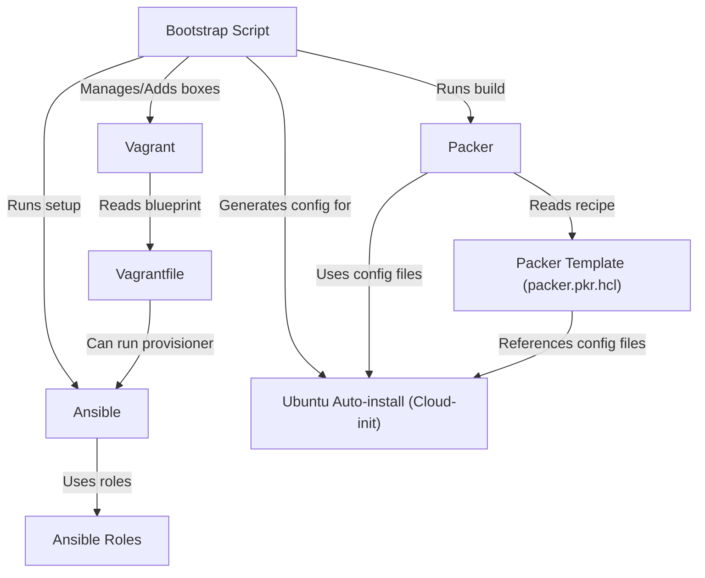

# Tutorial: devsetups

This project provides an automated way to set up consistent development environments.
It uses **Packer** to build a base virtual machine image, **Vagrant** to manage and provision the virtual machine using a **Vagrantfile**, and **Ansible** with **Ansible Roles** to configure the installed software and tools. A central **Bootstrap Script** ties everything together, automating the installation of these tools and the execution of the setup process on either a host machine or within a newly provisioned VM, often leveraging **Ubuntu Auto-install (Cloud-init)** during the initial VM image creation.

## Visual Overview

## Chapters

1. [Bootstrap Script
](01_bootstrap_script_.md)
2. [Packer
](02_packer_.md)
3. [Vagrant
](03_vagrant_.md)
4. [Ansible
](04_ansible_.md)
5. [Packer Template (packer.pkr.hcl)
](05_packer_template__packer_pkr_hcl__.md)
6. [Ubuntu Auto-install (Cloud-init)
](06_ubuntu_auto_install__cloud_init__.md)
7. [Vagrantfile
](07_vagrantfile_.md)
8. [Ansible Roles
](08_ansible_roles_.md)

---

Generated by [AI Codebase Knowledge Builder](https://github.com/The-Pocket/Tutorial-Codebase-Knowledge).