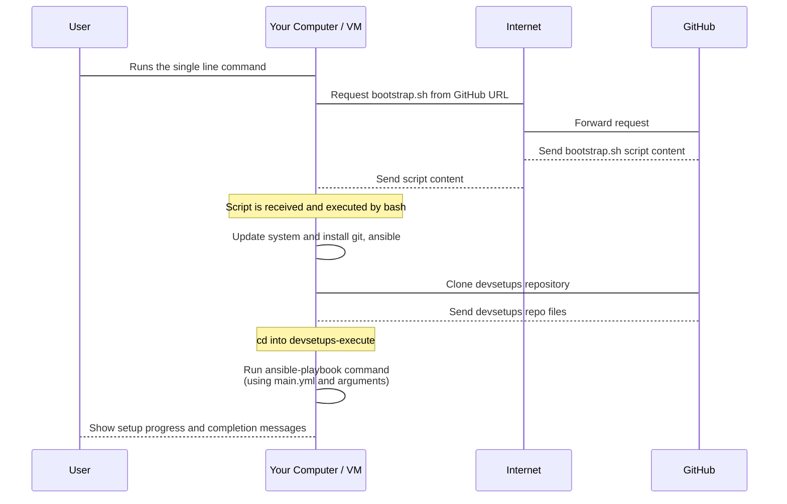

# Chapter 1: Bootstrap Script

Imagine you've just set up a brand new computer or a virtual machine. It's empty! Now, you need to install Git, maybe Docker, a specific programming language runtime like .NET, a code editor like VS Code, and tweak some settings. Doing all this manually can take a long time, especially if you have to do it often for different projects or environments. It's also easy to forget a step or make a mistake.

This is where the **Bootstrap Script** comes in! Think of it as your personal setup assistant.

## What is the Bootstrap Script?

In the `devsetups` project, the Bootstrap Script (`bootstrap.sh`) is the very first thing you run to kickstart the whole setup process. It's a simple script designed to automate the initial steps needed to get your environment ready for configuration.

Its main jobs are:

1.  **Install essential tools:** It makes sure you have critical tools like `Ansible` (our main configuration tool) and `Git` (needed to get the rest of the setup code).
2.  **Get the project:** It downloads *this* `devsetups` repository containing all the setup instructions onto your machine.
3.  **Start the main setup:** Once it has Ansible and the setup code, it runs the correct Ansible instructions to configure your system according to your needs.

It's like a tiny installer program that sets up the tools needed to run the *real* installer (Ansible).

## How Do I Use It?

The simplest way to use the Bootstrap Script is often through a single command. You'll find variations of this command in the project's `README.md` file, like this one for a basic setup:

```bash
wget --header="Cache-Control: no-cache" -qO- "https://raw.githubusercontent.com/arslan-qamar/devsetups/refs/heads/main/bootstrap.sh?ts=$(date +%s)" | bash -s "main.yml" "localhost," "local" "install" "deps,devbox,docker,githubcli,vscode"
```

Let's break down what this command does from your perspective:

*   `wget ... | bash`: This part is a common trick in the Linux world. It downloads the `bootstrap.sh` script directly from the internet (specifically from GitHub where the project lives) and immediately feeds its content into the `bash` command, which executes it. This means you don't even need to save the script to your computer first!
*   `bash -s "main.yml" "localhost," "local" "install" "deps,devbox,docker,githubcli,vscode"`: This part tells the `bash` interpreter to run the script it received and passes along some important pieces of information (called arguments) to the script. These arguments tell the bootstrap script *what* to do next:
    *   `"main.yml"`: This is the name of the main Ansible instruction file (called a playbook) to run.
    *   `"localhost,"`: This tells Ansible to run the setup commands directly on the machine where the script is executing (your computer or VM).
    *   `"local"`: This specifies how Ansible should connect to the target machine (in this case, it just runs commands locally).
    *   `"install"`: This indicates the desired state – we want to *install* or set up things (the alternative could be `uninstall`).
    *   `"deps,devbox,docker,githubcli,vscode"`: These are specific tags. Tags are like labels within the Ansible instructions that let you choose which parts of the setup you want to run. This example tells the script to run the setup steps for dependencies, the basic development environment, Docker, GitHub CLI, and VS Code.

So, running that single line essentially says: "Go get the latest setup script from the internet, run it, and tell it to set up dependencies, dev tools, Docker, GitHub CLI, and VS Code on this machine."

## How Does It Work Under the Hood?

Let's peek behind the curtain a bit. When you run that command, here's a simplified sequence of events:



Here’s a breakdown of the steps within the `bootstrap.sh` script itself:

1.  **Preparation:** The script starts with `set -exuo pipefail`. This is a safety measure common in shell scripting. It ensures that the script will exit immediately if any command fails, if you try to use a variable that hasn't been set, and prevents errors in pipelines. This helps catch problems early.
2.  **Install Dependencies:** It checks what type of Linux package manager your system uses (`apt` for Ubuntu/Debian, `dnf` for Fedora, `yum` for older RedHat/CentOS, `pacman` for Arch) and then uses the correct command (`sudo apt install -y ansible git`, for example) to install Ansible and Git. This is crucial because the rest of the setup relies on these tools.
    ```bash
    # Step 1: Update system and install dependencies (Ansible and curl)
    echo "[+] Installing dependencies..."
    if [ -x "$(command -v apt)" ]; then
      sudo apt update
      sudo apt install -y ansible git
    # ... other package managers ...
    else
      echo "[-] Unsupported package manager. Please install dependencies manually."
      exit 1
    fi
    ```
    *This snippet shows how the script checks for your system's package manager and installs Ansible and Git.*
3.  **Clone Repository:** It defines the URL of the `devsetups` GitHub repository. It then removes any existing directory with the target name (`devsetups-execute`) to ensure a clean start and clones the latest version of the repository from GitHub. Finally, it changes the current directory (`cd`) to the newly cloned project folder.
    ```bash
    # Checkout fresh git repo
    REPO_URL="https://github.com/arslan-qamar/devsetups.git"
    TARGET_DIR="devsetups-execute"

     # Remove existing directory if it exists
    rm -rf "$TARGET_DIR"
    echo "Cloning repository..."
    git clone "$REPO_URL" "$TARGET_DIR"
    cd "$TARGET_DIR"
    ```
    *Here you see the commands to remove an old version and download the project files.*
4.  **Run Ansible Playbook:** This is the core step. The script takes the arguments you provided (like `"main.yml"`, `"localhost,"`, `"local"`, `"install"`, `"deps,devbox,docker,githubcli,vscode"`) and uses them to construct and run the `ansible-playbook` command.
    ```bash
    # Run the Playbook file
    PLAYBOOK_FILE="${1:-main.yml}" # Gets the 1st argument, default main.yml
    INVENTORY="${2:-localhost,}" # Gets the 2nd argument, default localhost
    CONNECTION="${3:-local}" # Gets the 3rd argument, default local
    STATE=$(case "${4:-install}" in install) echo "present";; uninstall) echo "absent";; *) echo "present";; esac) # Gets 4th arg, converts to 'present'/'absent'
    TAGS="${5:-}" # Gets the 5th argument (tags)

    ansible-playbook -vvv "$PLAYBOOK_FILE" -i "$INVENTORY" --connection="$CONNECTION" --extra-vars "state=$STATE" ${TAGS:+-t="$TAGS"}
    ```
    *This part shows how the script captures the arguments you passed and uses them to run the main Ansible command.*

## Where Else Is It Used?

The Bootstrap Script isn't just for running manually on your computer. It's also used by other tools in the project! For example, when using [Vagrant](03_vagrant_.md) to create a virtual machine, the [Vagrantfile](07_vagrantfile_.md) often includes a step to automatically download and run the bootstrap script *inside* the newly created VM during its first boot. This ensures the VM gets the basic tools and the setup code immediately after it's created.

You can see this in the `Vagrantfile` snippet provided:

```ruby
# ... other Vagrant configuration ...

Vagrant.configure("2") do |config|
  # ... box definition ...

  # Run bootstrap script on first boot
  config.vm.provision "shell", privileged: false, inline: <<-SHELL
    set -e
    echo "Downloading and running bootstrap..."
    # This line downloads and runs the bootstrap script inside the VM!
    wget --header="Cache-Control: no-cache" -qO- "https://raw.githubusercontent.com/arslan-qamar/devsetups/refs/heads/main/bootstrap.sh?ts=$(date +%s)" | bash -s "main.yml" "localhost," "local" "install" "deps,devbox,docker,githubcli,vscode,zsh,dotnet,hcp"
    # ... other VM setup commands ...
  SHELL

  # ... provider specific configuration ...
end
```
*This snippet from a [Vagrantfile](07_vagrantfile_.md) shows how Vagrant runs the same bootstrap command automatically inside the virtual machine.*

This demonstrates that the Bootstrap Script is a reusable entry point, whether you're setting up your main computer or a fresh virtual environment.

## Conclusion

The Bootstrap Script is the essential first step in using `devsetups`. It handles the initial hurdles of installing required tools and getting the project code onto your machine. Once it's done, it hands over control to Ansible, which does the heavy lifting of configuring your environment based on the detailed instructions within the project.

Now that you understand how the bootstrap script gets everything started, you might wonder how the project ensures you have a consistent base operating system environment *before* the script even runs. That's where [Packer](02_packer_.md) comes in.

[Chapter 2: Packer](02_packer_.md)

---

<sub><sup>Generated by [AI Codebase Knowledge Builder](https://github.com/The-Pocket/Tutorial-Codebase-Knowledge).</sup></sub> <sub><sup>**References**: [[1]](https://github.com/arslan-qamar/devsetups/blob/cd5cb98b078b41c16f6bd228f33880ad55b52475/Host/README), [[2]](https://github.com/arslan-qamar/devsetups/blob/cd5cb98b078b41c16f6bd228f33880ad55b52475/README.md), [[3]](https://github.com/arslan-qamar/devsetups/blob/cd5cb98b078b41c16f6bd228f33880ad55b52475/bootstrap.sh), [[4]](https://github.com/arslan-qamar/devsetups/blob/cd5cb98b078b41c16f6bd228f33880ad55b52475/ibkr/Vagrantfile)</sup></sub>