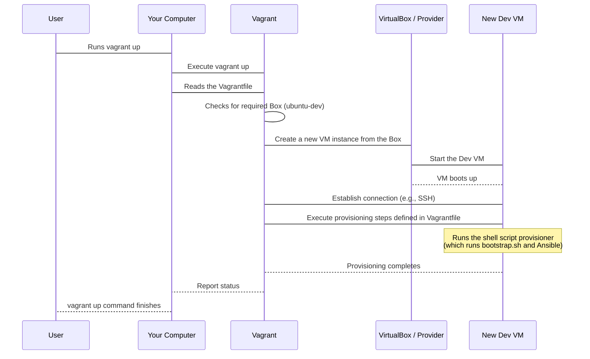

# Chapter 3: Vagrant

Welcome back! In [Chapter 1: Bootstrap Script](01_bootstrap_script_.md), we saw how a single script can start the process of installing tools like Git and Ansible on a machine. In [Chapter 2: Packer](02_packer_.md), we learned how Packer creates consistent, reusable base operating system images (like our `ubuntu-dev` box) – think of it as preparing identical "cookie dough".

Now, how do we easily get from that consistent base image to a fully configured, ready-to-code development environment, and do it repeatedly and reliably? Manually setting up a virtual machine (VM), installing the OS, and then running setup scripts every time you need a new environment is tedious and error-prone. This is where the dreaded "It worked on my machine!" problem often starts – small differences in how environments are set up can cause mysterious bugs.

## What is Vagrant?

**Vagrant** is the tool that solves this problem. It's designed specifically for building and managing portable, reproducible development environments.

Think of Vagrant as a **director** for virtual machines. It takes the consistent base image built by Packer (the "cookie dough") and quickly spins up pre-configured VMs (the "baked cookies"), ready for your specific project setup. It handles:

*   Creating the VM from a base image ("box").
*   Configuring the VM's resources (memory, CPU).
*   Setting up networking so your host machine can communicate with the VM.
*   Running **provisioning** steps (like executing our [Bootstrap Script](01_bootstrap_script_.md) and then [Ansible](04_ansible_.md)) to install software and configure the environment *inside* the VM.

Vagrant ensures that everyone on a team (or even just you, working on different projects) is using the exact same environment, starting from the same base image and configured using the same scripts. This drastically reduces "works on my machine" issues.

## Vagrant's Role in `devsetups`

In the `devsetups` project, Vagrant is used to spin up virtual machines based on the `ubuntu-dev` image that Packer built. It then uses the [Bootstrap Script](01_bootstrap_script_.md) and [Ansible](04_ansible_.md) to turn that base Ubuntu image into a fully-fledged development workstation with all the necessary tools installed (like Docker, VS Code, .NET, etc.).

The typical workflow looks like this:

1.  (One time setup): Use the `ubuntu-autoinstall/bootstrap.sh` script which runs [Packer](02_packer_.md) to build the `ubuntu-dev.box` image and adds it to Vagrant.
2.  (Per project/environment): Use Vagrant to create and manage a VM based on the `ubuntu-dev` box, applying project-specific configurations.

## Core Vagrant Concepts

Vagrant revolves around a few key ideas:

*   **Boxes:** These are the base images, like our `ubuntu-dev` box. They are the starting point for any Vagrant environment. You can get boxes from HashiCorp's Vagrant Cloud, build your own with Packer, or use local ones.
*   **Vagrantfile:** This is the central configuration file for a Vagrant environment. It's written in Ruby (but don't worry, you don't need to know Ruby to use it!). It tells Vagrant:
    *   Which **box** to use.
    *   How to configure the **VM** (network, memory, etc.).
    *   What **provisioning** steps to run *inside* the VM after it boots.
*   **Commands:** Simple command-line tools to control your Vagrant environments (`vagrant up`, `vagrant ssh`, `vagrant destroy`, etc.).

## Using Vagrant: The `vagrant up` Command

The most common Vagrant command is `vagrant up`. When you run this command in a directory containing a `Vagrantfile`, it performs all the steps needed to create, configure, and start the virtual machine described in that file.

Let's look at a simple example from the `devsetups` project, using the `ibkr/Vagrantfile`. This `Vagrantfile` is designed to set up an environment specific to working with the Interactive Brokers API.

```bash
# First, make sure you have VirtualBox installed
# and have run the ubuntu-autoinstall/bootstrap.sh
# script at least once to build and add the ubuntu-dev box.

# 1. Navigate to the directory containing the specific Vagrantfile
cd ibkr/

# 2. Run the command to start the environment
vagrant up
```

**What happens when you run `vagrant up`?**

Vagrant reads the `ibkr/Vagrantfile` (which itself loads settings from `ubuntu-autoinstall/vagrant-base/Vagrantfile.base`). Based on the instructions in the `Vagrantfile`, it will:

1.  Check if the specified box (`ubuntu-dev`) is available.
2.  Create a new virtual machine using that `ubuntu-dev` box as the starting point.
3.  Configure the VM according to the `Vagrantfile` (e.g., set memory, networking).
4.  Boot the virtual machine.
5.  Run the defined **provisioning** steps *inside* the running VM. In the `ibkr/Vagrantfile`, this includes running a shell script provisioner:
    ```ruby
    # Snippet from ibkr/Vagrantfile

    config.vm.provision "shell", privileged: false, inline: <<-SHELL
      set -e
      echo "Downloading and running bootstrap..."
      # This line downloads and runs the bootstrap script inside the VM!
      wget --header="Cache-Control: no-cache" -qO- "https://raw.githubusercontent.com/arslan-qamar/devsetups/refs/heads/main/bootstrap.sh?ts=$(date +%s)" | bash -s "main.yml" "localhost," "local" "install" "deps,devbox,docker,githubcli,vscode,zsh,dotnet,hcp"
      # ... other project-specific setup commands ...
    SHELL
    ```
    *This snippet from `ibkr/Vagrantfile` shows how Vagrant is told to run a specific shell script inside the new VM. Notice it's running the same [Bootstrap Script](01_bootstrap_script_.md) we discussed in Chapter 1!*

This provisioning step is where the real environment configuration happens. The shell script runs the `devsetups` [Bootstrap Script](01_bootstrap_script_.md), which in turn uses [Ansible](04_ansible_.md) to install all the tools (like Docker, VS Code, .NET, etc.) and configure the environment inside the new VM.

After `vagrant up` finishes, you have a fully configured virtual development environment running, identical to what anyone else running the same `Vagrantfile` would get.

## Accessing the VM: `vagrant ssh`

Once the VM is up and running, you can easily connect to it via SSH:

```bash
# Make sure you are still in the directory with the Vagrantfile (e.g., ibkr/)
vagrant ssh
```

This command automatically connects you to the running VM. You can now work inside this consistent environment.

## Cleaning Up: `vagrant destroy`

When you're done with the VM, you can easily shut it down and remove all traces of it:

```bash
# Make sure you are still in the directory with the Vagrantfile (e.g., ibkr/)
vagrant destroy
```

This command prompts you to confirm and then safely powers off and deletes the virtual machine and its associated disk files. It's like disposing of the used cookie wrapper – the base image (the box) remains, ready to bake a new one whenever you need it.

## How Vagrant Works (Simply)

Let's visualize the `vagrant up` process:



In summary, when you run `vagrant up`:

1.  Vagrant reads the `Vagrantfile` to understand the desired environment configuration.
2.  It uses the specified virtualization provider (like VirtualBox, defined in the `Vagrantfile`) to create a new virtual machine based on the chosen "box" (our `ubuntu-dev.box`).
3.  It applies network and resource settings defined in the `Vagrantfile`.
4.  It boots the new VM.
5.  Once the VM is running and accessible (usually via SSH), Vagrant executes the "provisioning" instructions listed in the `Vagrantfile`.
6.  In `devsetups`, this provisioning step runs a shell script that fetches and executes the main `bootstrap.sh` script.
7.  The `bootstrap.sh` script then uses [Ansible](04_ansible_.md) (which it installs itself if needed) to perform the detailed configuration and software installation *inside* the VM.

The `Vagrantfile` essentially tells Vagrant the recipe: "Start with this base OS (box), give it this much memory, connect it like this, and then run *these* specific setup commands (provisioning)."

We will explore the `Vagrantfile` syntax in more detail in [Chapter 7: Vagrantfile](07_vagrantfile_.md).

## Conclusion

Vagrant is your go-to tool for quickly creating, managing, and destroying consistent development environments based on predefined images. It uses the clean base image built by [Packer](02_packer_.md) and orchestrates the setup process by running [provisioning](04_ansible_.md) steps (including our essential [Bootstrap Script](01_bootstrap_script_.md)) inside the newly created virtual machine. This ensures that your environment is always reproducible.

Now that you know how Vagrant spins up and runs setup scripts inside a VM, the next logical step is to understand the tool that performs the *actual* configuration and software installation within that VM: [Ansible](04_ansible_.md).

[Chapter 4: Ansible](04_ansible_.md)

---

<sub><sup>Generated by [AI Codebase Knowledge Builder](https://github.com/The-Pocket/Tutorial-Codebase-Knowledge).</sup></sub> <sub><sup>**References**: [[1]](https://github.com/arslan-qamar/devsetups/blob/cd5cb98b078b41c16f6bd228f33880ad55b52475/README.md), [[2]](https://github.com/arslan-qamar/devsetups/blob/cd5cb98b078b41c16f6bd228f33880ad55b52475/ibkr/Vagrantfile), [[3]](https://github.com/arslan-qamar/devsetups/blob/cd5cb98b078b41c16f6bd228f33880ad55b52475/roles/vagrant/README), [[4]](https://github.com/arslan-qamar/devsetups/blob/cd5cb98b078b41c16f6bd228f33880ad55b52475/roles/vagrant/tasks/main.yml), [[5]](https://github.com/arslan-qamar/devsetups/blob/cd5cb98b078b41c16f6bd228f33880ad55b52475/ubuntu-autoinstall/vagrant-base/Vagrantfile), [[6]](https://github.com/arslan-qamar/devsetups/blob/cd5cb98b078b41c16f6bd228f33880ad55b52475/ubuntu-autoinstall/vagrant-base/Vagrantfile.base)</sup></sub>