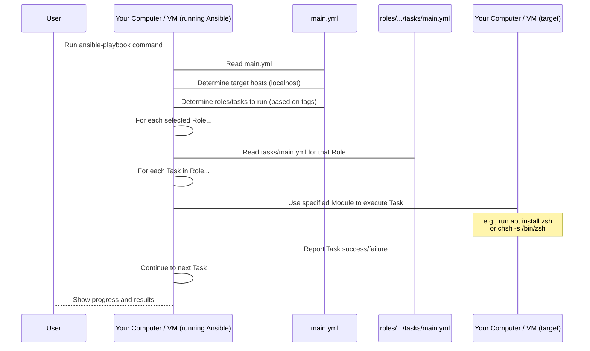

# Chapter 4: Ansible

Welcome back! In [Chapter 3: Vagrant](03_vagrant_.md), we saw how Vagrant uses the consistent base image built by [Packer](02_packer_.md) to quickly create a brand new virtual machine and run initial setup scripts inside it. But what exactly *are* those setup scripts doing? How do they reliably install all the software you need (like Docker, VS Code, .NET, etc.) and configure your environment exactly the way you want it, every single time?

This is the main job of **Ansible**.

Imagine you've just baked a batch of identical cookies using your cookie cutter ([Packer](02_packer_.md)) and placed them on a tray ([Vagrant]). Now you need to add specific decorations, frosting, and sprinkles to turn them into specialized cookies for different occasions (your development environments). Doing this manually for hundreds of cookies would be a nightmare!

## What is Ansible?

**Ansible** is an automation engine. It's like having a super-efficient robot that can follow a detailed instruction manual to set up your computer or server just the way you want it. In the context of `devsetups`, Ansible is the tool that:

1.  **Installs Software:** Automatically puts programs like Docker, Git, VS Code, specific programming language runtimes, etc., onto the machine.
2.  **Configures Settings:** Changes system settings, sets up users, configures shell environments (like Zsh), and manages application configurations.
3.  **Ensures Consistency:** Makes sure the setup is exactly the same every time it's run on a similar base machine.

Once a VM is provisioned by [Vagrant](03_vagrant_.md), or the [Bootstrap Script](01_bootstrap_script_.md) gets the initial tools onto a host machine, Ansible steps in to perform all these detailed configuration tasks. It's the engine that drives the "configuration management" part of `devsetups`.

## Ansible's Role in `devsetups`

In the `devsetups` project, Ansible is the workhorse for turning a basic Ubuntu operating system (whether it's a VM from [Vagrant](03_vagrant_.md) or your host machine after running [Bootstrap Script](01_bootstrap_script_.md)) into a ready-to-use development environment.

Instead of manually typing commands to install software or edit configuration files, you describe the desired *state* of your system in Ansible's instruction files. Ansible then figures out the steps needed to reach that state and executes them automatically.

## Core Ansible Concepts (Simplified)

To understand how Ansible does its magic, let's look at a few key terms:

*   **Control Node:** This is the machine where you run Ansible. In our `devsetups` case, when you run the [Bootstrap Script](01_bootstrap_script_.md) or Vagrant runs its provisioner, your computer (or the VM itself) acts as the Control Node. Ansible is installed here.
*   **Managed Node(s):** These are the machines Ansible is configuring. In `devsetups`, this is typically `localhost` (your host machine) or the virtual machine spun up by [Vagrant](03_vagrant_.md).
*   **Playbook:** A file (written in YAML) that contains a list of instructions for Ansible to execute. Think of it as the main recipe book. In `devsetups`, `main.yml` is our primary playbook.
*   **Task:** A single action within a playbook or a role. This is one specific step in the recipe, like "Install the Zsh package" or "Copy this configuration file."
*   **Module:** Ansible has hundreds of small programs called modules. Each module is designed to perform a specific task (like installing packages, managing services, copying files, executing shell commands). A task uses a module to get something done. Think of modules as the specialized tools or utensils (the `apt` module is the "package installer spoon," the `copy` module is the "file spatula").
*   **Role:** A way to organize related tasks, variables, and files together for a specific purpose, like setting up Zsh, Docker, or VS Code. Playbooks use roles to keep things tidy. This is like having separate mini-recipes for "Zsh setup" or "Docker setup" that you can include in your main recipe book ([Chapter 8: Ansible Roles](08_ansible_roles_.md) covers roles in detail).
*   **Inventory:** A list of the Managed Nodes that Ansible should configure. In our simple local setup, the inventory is often just `localhost,` meaning "the machine I'm currently running on."

## How `devsetups` Runs Ansible

You don't typically run complex `ansible-playbook` commands yourself directly. As we saw in [Chapter 1: Bootstrap Script](01_bootstrap_script_.md) and [Chapter 3: Vagrant](03_vagrant_.md), the process is automated.

Let's revisit the command run by the [Bootstrap Script](01_bootstrap_script_.md) or the Vagrant provisioner:

```bash
ansible-playbook -vvv "main.yml" -i "localhost," --connection="local" --extra-vars "state=present" -t="deps,devbox,docker,githubcli,vscode"
```

This single command tells Ansible everything it needs to know:

*   `ansible-playbook`: Execute Ansible instructions from a playbook.
*   `-vvv`: Be very verbose! Show detailed output of what Ansible is doing (helpful for debugging).
*   `"main.yml"`: Use this file as the main recipe (the Playbook).
*   `-i "localhost,"`: Configure the machine where this command is running (the Inventory is just `localhost`). The comma is important syntax for single hosts.
*   `--connection="local"`: Connect to the target machine (which is `localhost`) by running commands directly, rather than over SSH (which is the default).
*   `--extra-vars "state=present"`: Pass a variable called `state` with the value `present` to the playbook. Many tasks in `devsetups` check this variable to know whether to install (`present`) or uninstall (`absent`).
*   `-t="deps,devbox,docker,githubcli,vscode"`: Only run the tasks or roles in the playbook that have *any* of these tags assigned to them. This allows you to customize which parts of the setup run.

When you run this command (or the script that runs it), Ansible reads `main.yml` and starts executing the tasks for the specified tags on your machine.

## Inside the Ansible Playbook (`main.yml`)

The `main.yml` file is the starting point. It doesn't contain all the detailed steps itself; instead, it lists the different sets of configurations (the [Roles](08_ansible_roles_.md)) that should be applied and links them to the tags.

Here's a simplified look at the structure of `main.yml`:

```yaml
---
# This is the main Playbook file

- name: Running Ansible Roles
  # Which machines to run on? Get it from the variable passed by the script,
  # or default to 'localhost'
  hosts: "{{ target_hosts | default('localhost') }}"
  # Use the 'local' connection method, also from a variable or default
  connection: "{{ connection | default('local') }}"
  # Enable privilege escalation (like 'sudo') for tasks that need it
  become: yes

  # List the roles to run
  roles:
    # This role sets up dependencies
    - role: deps
      tags: deps

    # This role sets up the basic dev environment
    - role: devbox
      tags: devbox

    # This role installs and configures Docker
    - role: docker
      tags: docker

    # This role installs GitHub CLI
    - role: githubcli
      tags: githubcli

    # This role installs VS Code
    - role: vscode
      tags: vscode

    # ... and many more roles ...
```

*This snippet from `main.yml` shows how it specifies which machines to target (`hosts`), how to connect (`connection`), and lists the different bundles of configuration steps (`roles`) to execute, associating each with a `tag`.*

When Ansible runs `main.yml` with `-t="deps,docker,vscode"`, it looks at this list and says: "Okay, I need to run the `deps` role, the `docker` role, and the `vscode` role on the `localhost` machine."

## Inside an Ansible Role (`roles/zsh/tasks/main.yml`)

Each role (like the `zsh` role for setting up the Zsh shell) has its own set of instructions, typically in a file named `tasks/main.yml` within the role's directory. This is where the specific steps happen, using Ansible Modules.

Here's a simplified peek into the `zsh` role's tasks:

```yaml
# roles/zsh/tasks/main.yml

- name: Ensure zsh is {{ state }} # Task description
  become: yes # This task needs root privileges (like using sudo)
  # Use the 'apt' module to manage packages on Debian/Ubuntu systems
  apt:
    name: zsh # The name of the package to manage
    state: "{{ state }}" # Should it be 'present' (installed) or 'absent' (removed)?
    update_cache: yes # Update the package list before installing

- name: Set default shell to zsh using chsh
  become: yes
  # Use the 'shell' module to run a raw shell command
  shell: chsh -s /usr/bin/zsh {{ ansible_user_id }}
  args:
    executable: /bin/bash # Make sure the command runs using bash
  when: state == 'present' # Only run this task if we are installing (state is 'present')

# ... many more tasks for Oh My Zsh, plugins, etc. ...
```

*This snippet from `roles/zsh/tasks/main.yml` shows individual tasks. The first task uses the `apt` module to install or remove the `zsh` package. The second task uses the `shell` module to run a command to change the default shell.*

Each `- name:` entry is a single **Task**. It describes *what* needs to be done. Below it, you see the **Module** being used (`apt`, `shell`). The options under the module (`name`, `state`, `shell`, `args`, `when`) are parameters specific to that module, telling it *how* to perform the task.

Ansible reads these tasks one by one and executes them on the Managed Node (`localhost` in this case), using the specified modules. It's smart enough to check if the desired state is already met; for example, if `zsh` is already installed, the `apt` task for `state: present` will do nothing, saving time.

Roles can also have variables (like the list of plugins in `roles/zsh/vars/main.yml`) that tasks can use, making them reusable and configurable. We'll see more about this in [Chapter 8: Ansible Roles](08_ansible_roles_.md).

## How Ansible Works Under the Hood (Simply)

When the `ansible-playbook` command runs:



In essence:

1.  Ansible starts on the Control Node (your machine/VM).
2.  It reads the main Playbook (`main.yml`).
3.  Based on the command line arguments (`-i`, `-t`, `--extra-vars`), it figures out which Managed Nodes to configure (`localhost`) and which specific [Roles](08_ansible_roles_.md) and Tasks it needs to perform.
4.  For each selected [Role](08_ansible_roles_.md), it reads the list of Tasks (from `tasks/main.yml`).
5.  For each Task, it identifies the required Ansible Module (`apt`, `shell`, `copy`, etc.).
6.  It then uses that Module to connect to the Managed Node (using the specified connection method, `local` in this case) and performs the action needed to achieve the desired state.
7.  It reports back the results of each Task (whether it made a change or if the desired state was already met).
8.  Ansible continues through all the selected tasks in all selected roles until the playbook run is complete.

This automated process is much faster and more reliable than performing all these steps manually.

## Conclusion

Ansible is the engine that performs the actual configuration work in `devsetups`. It takes the instructions written in playbooks and roles, uses specific modules to interact with the target system, and ensures that software is installed and settings are configured according to the project's definition. While [Packer](02_packer_.md) builds the consistent base image and [Vagrant](03_vagrant_.md) orchestrates spinning up virtual machines and running the initial setup script, Ansible is the tool that does the heavy lifting of turning that base OS into a fully equipped development environment.

You've now seen how the entry point ([Bootstrap Script](01_bootstrap_script_.md)), the image builder ([Packer](02_packer_.md)), and the VM manager ([Vagrant](03_vagrant_.md)) work together, and how Ansible is the core tool executing the detailed configuration steps. The next chapter will dive into the blueprint that guides [Packer](02_packer_.md) in building the initial image: the `packer.pkr.hcl` template.

[Chapter 5: Packer Template (packer.pkr.hcl)](05_packer_template__packer_pkr_hcl__.md)

---

<sub><sup>Generated by [AI Codebase Knowledge Builder](https://github.com/The-Pocket/Tutorial-Codebase-Knowledge).</sup></sub> <sub><sup>**References**: [[1]](https://github.com/arslan-qamar/devsetups/blob/cd5cb98b078b41c16f6bd228f33880ad55b52475/README.md), [[2]](https://github.com/arslan-qamar/devsetups/blob/cd5cb98b078b41c16f6bd228f33880ad55b52475/bootstrap.sh), [[3]](https://github.com/arslan-qamar/devsetups/blob/cd5cb98b078b41c16f6bd228f33880ad55b52475/main.yml), [[4]](https://github.com/arslan-qamar/devsetups/blob/cd5cb98b078b41c16f6bd228f33880ad55b52475/roles/zsh/tasks/main.yml), [[5]](https://github.com/arslan-qamar/devsetups/blob/cd5cb98b078b41c16f6bd228f33880ad55b52475/roles/zsh/vars/main.yml)</sup></sub>