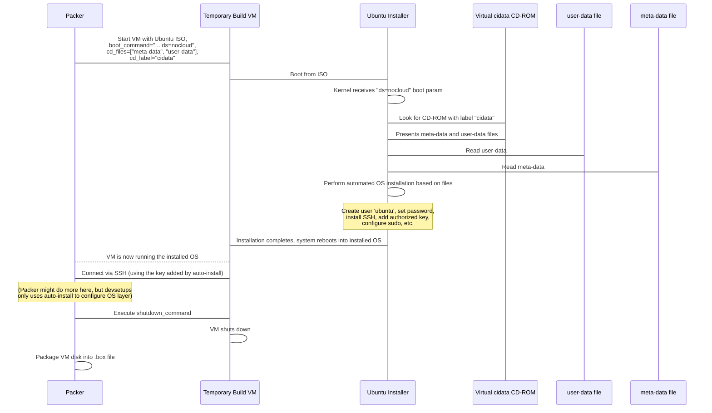

# Chapter 6: Ubuntu Auto-install (Cloud-init)

Welcome back! In our previous chapters, we've built up a powerful workflow: we know how the [Bootstrap Script](01_bootstrap_script_.md) kicks things off, how [Packer](02_packer_.md) creates consistent base images, how [Vagrant](03_vagrant_.md) uses those images to spin up VMs, and how [Ansible](04_ansible_.md) configures the software inside them. In [Chapter 5: Packer Template (packer.pkr.hcl)](05_packer_template__packer_pkr_hcl__.md), we looked at the blueprint Packer uses to build our `ubuntu-dev` base image.

We saw that the `packer.pkr.hcl` template tells Packer to boot a temporary VM from an Ubuntu ISO and pass special commands to the installer. But what magic happens *during* that OS installation to make it fully automatic? How does the Ubuntu installer know what user to create, what password to set (or not set), and how to configure basic things without someone sitting there clicking "Next"?

This is handled by a standard feature in Ubuntu (and many other Linux distributions) called **Cloud-init**, often used here in the context of **Ubuntu's Auto-install**.

## What is Ubuntu Auto-install (Cloud-init)?

Imagine installing an operating system like Ubuntu manually. You have to choose your language, time zone, keyboard layout, partition the disk, create a user account, set a password, decide whether to install SSH server, etc. That takes time and requires human input.

**Ubuntu Auto-install** uses **Cloud-init** to make this process completely hands-off. Cloud-init is a widely-used industry standard for customizing Linux instances as they boot for the *very first time*.

Think of it as an automated setup assistant that wakes up when the OS installation starts or when the freshly installed system boots for the first time. Instead of asking you questions, it reads instructions from specific configuration files you provide.

In the context of `devsetups` and Packer, we're using Cloud-init's **autoinstall** feature during the OS installation phase itself.

The key idea is that you provide plain text files (`user-data` and `meta-data`) that contain all the configuration details the installer needs.

| File        | Purpose                                                       | Analogy                                       |
| :---------- | :------------------------------------------------------------ | :-------------------------------------------- |
| `user-data` | Contains the main configuration instructions: create users, set up SSH keys, run commands, configure apt, etc. (YAML format). | The detailed instruction list for the assistant. |
| `meta-data` | Provides basic identification about the instance: hostname, instance ID. (Key-value format). | A simple label tag on the instruction list.   |

By providing these files to the Ubuntu installer via Packer, we can build a consistent base OS installation every time without any manual steps.

## How `devsetups` Uses Auto-install

In `devsetups`, the `ubuntu-autoinstall` directory contains the files needed for this automated setup during the Packer build:

1.  **`user-data.tpl`**: A template file for the `user-data`. It's a template because it needs to include values that are generated or chosen when you run the `ubuntu-autoinstall/bootstrap.sh` script, like the hashed password and the public SSH key.
2.  **`meta-data`**: A simple file with basic instance information.
3.  **`ubuntu-autoinstall/bootstrap.sh`**: This script (which we briefly saw in [Chapter 2](02_packer_.md)) does the setup *before* running Packer. One of its main jobs is to take the `user-data.tpl` template, fill in the dynamic values (like the password you entered and the generated SSH key), and save it as the final `user-data` file. It also ensures `meta-data` exists.
    ```bash
    # Snippet from ubuntu-autoinstall/bootstrap.sh

    # Step 1: Ask for a password ... (and hash it)
    hashed_password=$(echo "$ubuntu_password" | mkpasswd --method=SHA-512 --stdin)

    # Step 2: Generate a new SSH key ...
    public_key=$(cat "${ssh_key_path}.pub")

    # Step 3: Generate the user-data file from the template
    user_data_template="user-data.tpl"
    user_data_file="user-data"
    # Remove old file and generate new one, replacing placeholders
    sed "s|{{ ubuntu_password }}|$hashed_password|g; s|{{ ssh_authorized_key }}|$public_key|g" "$user_data_template" > "$user_data_file"

    # Step 4: Run Packer ... (uses user-data and meta-data)
    # ...
    ```
    *This shows how the bootstrap script generates the specific `user-data` file used for the build by filling in the password and SSH key.*
4.  **`packer.pkr.hcl`**: The Packer template file ([Chapter 5](05_packer_template__packer_pkr_hcl__.md)). This file tells Packer how to present the `user-data` and `meta-data` files to the Ubuntu installer. It does this in the `source "virtualbox-iso"` block:
    *   It adds a special parameter (`ds=nocloud`) to the kernel's `boot_command`. This tells the Ubuntu installer to activate the "nocloud" datasource, meaning it should look for configuration files locally instead of reaching out to cloud providers.
    *   It uses `cd_files` to attach `user-data` and `meta-data` as files on a virtual CD-ROM.
    *   It uses `cd_label` to label this virtual CD-ROM as `cidata`. The `nocloud` datasource specifically looks for a CD-ROM with the label `cidata` containing `user-data` and `meta-data`.
    ```hcl
    # Snippet from ubuntu-autoinstall/packer.pkr.hcl (source block)

    boot_command = [
      "c", "<wait3s>",
      "linux /casper/vmlinuz --- autoinstall ds=nocloud", "<enter><wait3s>", // boot param
      "initrd /casper/initrd", "<enter><wait3s>",
      "boot", "<enter>"
    ]

    cd_files  = ["./meta-data", "./user-data"] // Attach these files
    cd_label  = "cidata" // Label the CD-ROM
    ```
    *These lines in `packer.pkr.hcl` are the link between Packer and the auto-install feature, directing the installer to the configuration files.*

When Packer starts the temporary VM for building, it boots from the Ubuntu ISO, sends the `boot_command` keystrokes, and presents the `user-data` and `meta-data` files via the virtual CD-ROM. The Ubuntu installer sees the `ds=nocloud` parameter, finds the `cidata` CD, reads the files, and proceeds with the installation automatically based on the instructions within them.

## Inside `user-data` (Simplified)

Let's look at the `user-data.tpl` file to see the kind of instructions it provides for the auto-installation. Remember, this is a template, so it has placeholders like `{{ ubuntu_password }}` and `{{ ssh_authorized_key }}` that `ubuntu-autoinstall/bootstrap.sh` fills in.

```yaml
#cloud-config
autoinstall:
  version: 1  
  identity:
    hostname: ubuntu-vm
    username: ubuntu
    password: "{{ ubuntu_password }}" # The hashed password goes here
  ssh:
     install-server: yes # Yes, please install the SSH server
     allow-pw: no # Do NOT allow password login via SSH
     authorized-keys:
       - {{ ssh_authorized_key }} # Add the generated public key for SSH login
  users:
    - name: ubuntu # Create a user named 'ubuntu'
      sudo: ALL=(ALL) NOPASSWD:ALL # Give this user passwordless sudo
      groups: sudo # Add the user to the sudo group
      shell: /bin/bash # Set bash as the default shell
      ssh_authorized_keys:
        - {{ ssh_authorized_key }} # Add the SSH key again (good practice)
  # late-commands:
      # - echo '...' # Commands to run late in the install process
```
*This simplified snippet from `user-data.tpl` shows key instructions for the Ubuntu installer: setting up the machine identity, configuring SSH access, and creating the main user with sudo privileges and the correct SSH key.*

This file tells the installer to:

*   Set the hostname to `ubuntu-vm`.
*   Create a user named `ubuntu`.
*   Set their password to the one you provided (which the script hashed).
*   **Crucially for automation:** Install the OpenSSH server and add your generated public key to the `ubuntu` user's authorized keys. It also disables password login over SSH, making it more secure and requiring the SSH key (which Packer and Vagrant will use to connect).
*   Give the `ubuntu` user passwordless `sudo` privileges. This is important because Ansible (which runs later via Vagrant provisioning) often needs to perform tasks with root privileges, and passwordless sudo makes this smooth in an automated environment.

The `ubuntu-autoinstall/bootstrap.sh` script takes this template, substitutes the placeholders with the actual hashed password and public key, and saves it as `user-data`. Packer then uses *that* generated `user-data` file for the build.

## Inside `meta-data`

The `meta-data` file is much simpler. It provides basic information about the instance itself.

```
instance-id: ubuntu-autoinstall
local-hostname: ubuntu-vm
```
*The `meta-data` file simply provides an instance ID and confirms the local hostname.*

This file is static in `devsetups` and doesn't require templating for our purposes.

## How Auto-install Works During the Packer Build (Under the Hood)

Let's visualize the auto-installation process during the Packer build step:



The Cloud-init auto-install feature is the key to getting a consistent, pre-configured base Ubuntu system installed inside the temporary VM. It sets up the user and SSH access that Packer (and later Vagrant) needs to interact with the VM.

## Conclusion

Ubuntu Auto-install, powered by Cloud-init, is the mechanism that allows Packer to install the base operating system (`ubuntu-dev`) in a completely automated and consistent way. By providing the `user-data` and `meta-data` files via a virtual CD-ROM, the Ubuntu installer knows exactly how to set up the initial system, including creating the necessary user and configuring SSH access using the public key generated by the `bootstrap.sh` script. This hands-free installation process is essential for creating the reliable starting point for our development environments.

Now that we understand how the base image is built consistently by Packer leveraging Ubuntu's auto-install feature, we can revisit how [Vagrant](03_vagrant_.md) uses this image and orchestrates the further configuration steps. The next chapter will dive into the details of the `Vagrantfile`.

[Chapter 7: Vagrantfile](07_vagrantfile_.md)

---

<sub><sup>Generated by [AI Codebase Knowledge Builder](https://github.com/The-Pocket/Tutorial-Codebase-Knowledge).</sup></sub> <sub><sup>**References**: [[1]](https://github.com/arslan-qamar/devsetups/blob/cd5cb98b078b41c16f6bd228f33880ad55b52475/ubuntu-autoinstall/bootstrap.sh), [[2]](https://github.com/arslan-qamar/devsetups/blob/cd5cb98b078b41c16f6bd228f33880ad55b52475/ubuntu-autoinstall/meta-data), [[3]](https://github.com/arslan-qamar/devsetups/blob/cd5cb98b078b41c16f6bd228f33880ad55b52475/ubuntu-autoinstall/packer.pkr.hcl), [[4]](https://github.com/arslan-qamar/devsetups/blob/cd5cb98b078b41c16f6bd228f33880ad55b52475/ubuntu-autoinstall/user-data.tpl)</sup></sub>