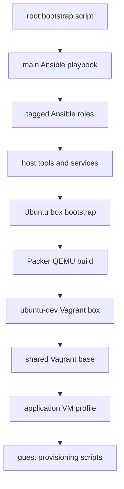

# Provisioning Architecture

## System shape

The repository is an environment-automation stack, not an application service. The root [`bootstrap.sh`](../../bootstrap.sh) installs the minimum executor tooling, clones a fresh repository copy into `~/devsetups-execute`, and runs [`main.yml`](../../main.yml) with an inventory, connection type, desired state, and optional tag list. That playbook is the composition point for independently taggable roles.

The same role catalog supplies the host dependencies used by the Ubuntu base-box builder. [`ubuntu-autoinstall/bootstrap.sh`](../../ubuntu-autoinstall/bootstrap.sh) then validates KVM/libvirt readiness, runs the selected prerequisite roles if necessary, and invokes Packer. The resulting `ubuntu-dev` box is consumed by the shared [`VagrantBaseFile`](../../ubuntu-autoinstall/vagrant-base/VagrantBaseFile), which is loaded by each profile under [`dev vms/`](../../dev%20vms/). Those profiles add guest provisioning and application-specific configuration as described in [Profile provisioning](../workflows/profile-provisioning.md).

*This flow shows the reusable build and VM provisioning chain; profiles select a subset of the same Ansible role catalog through their guest bootstrap script.*

## Ownership and execution boundaries

| Boundary | Main sources | Responsibility |
| --- | --- | --- |
| Host configuration | `bootstrap.sh`, `main.yml`, `roles/` | Install/remove tooling and configure services, groups, repositories, and selected host networking. |
| Base-image creation | `ubuntu-autoinstall/packer.pkr.hcl`, `user-data.tpl`, `bootstrap.sh` | Build a qcow2-based, libvirt-targeted `ubuntu-dev` box with Ubuntu autoinstall. |
| VM lifecycle | `ubuntu-autoinstall/vagrant-base/VagrantBaseFile` and helper scripts | Standardize VM identity, SSH, network selection, libvirt resources, SPICE, timezone, and optional resizing. |
| Guest/project customization | `dev vms/*/Vagrantfile`, `dev vms/provision_*.sh` | Install tagged tools inside the guest, move copied SSH material, clone a selected repository, configure signing/secrets, and validate. |
| Post-creation host operations | `toolbox/libvirt/` | Apply or reverse graphics XML changes and configure/reverse host GPU passthrough. |

[VM lifecycle](../workflows/vm-lifecycle.md) owns the handoff from base box to shared VM behavior. [Operations runbook](../operations/runbook.md) covers the privileged and reversible host-side paths that operate alongside it.

## Ansible role catalog

`main.yml` executes roles in a fixed listed order, each with a matching tag; no role metadata dependencies were identified. Callers must therefore choose a compatible tag set rather than expecting dependency resolution.

| Area | Tags in `main.yml` | Notes |
| --- | --- | --- |
| Foundation and languages | `deps`, `nodejs`, `go`, `python`, `dotnet`, `ruby`, `zsh` | Base packages and language/runtime tooling. |
| Developer applications | `devbox`, `githubcli`, `vscode`, `postman`, `mongodb_compass`, `rider` | Interactive developer tools and IDEs. |
| Containers and virtualization | `docker`, `qemu`, `kvm`, `libvirt`, `virtmanager`, `vagrant`, `packer`, `bridge` | Required stack for local libvirt VMs; `bridge` modifies host NetworkManager configuration. |
| Data and platform | `postgres`, `helm`, `kubectl`, `argocd`, `microk8s` | Local database and Kubernetes-oriented tooling. |
| Secret/config tooling | `hcp`, `doppler` | Used by host and some profile flows; repository docs refer to configuration variables without recording secret values. |

The [Testing and change guide](../testing-and-change-guide.md) connects these areas to available validation. The [Source map](../reference/source-map.md) gives the authoritative task and README locations for individual roles.

## Reusable VM contract

The shared base establishes a contract that profiles inherit:

- box name `ubuntu-dev`, hostname based on the working directory, SSH user `ubuntu`, and a required `VAGRANT_CUSTOM_KEY_PATH`;
- KVM/libvirt provider defaults of 6 CPUs, 16 GiB memory, SPICE/virtio video, and the SPICE agent channel;
- networking preference order of explicit `VAGRANT_BRIDGE`, active host bridge (preferring `br0`), active default-route uplink in direct mode, then private DHCP fallback;
- a pre/post-boot trigger that starts and enables autostart for `vagrant-libvirt` when that network exists; and
- optional VM disk growth driven by `VAGRANT_VM_DISK_SIZE_GB`.

These operational rules are expanded in [VM lifecycle](../workflows/vm-lifecycle.md#shared-vagrant-contract), because changes to the base affect every profile that loads it.

## Design history that matters

Recent commits show an evolution from basic local provisioning toward recoverable, host-aware VM operations:

- The April networking update added active-interface detection, direct attachment to the active uplink when no bridge exists, and `vagrant-libvirt` activation/autostart. This explains the base file’s layered network selection rather than a fixed interface.
- The May disk-resize update coordinates a host-side libvirt disk increase with an always-run guest root filesystem expansion. It distinguishes a newly requested virtual disk size from in-place growth for existing VMs.
- GPU passthrough and 3D graphics changes introduced explicit host configuration and reversal scripts. They remain opt-in operations outside normal profile creation.
- The latest PortfolioZen adjustment adds the `ruby` bootstrap tag, illustrating that profiles declare their tool requirements rather than changing the central role graph.

For the operational implications of these decisions, see [Operations runbook](../operations/runbook.md).
