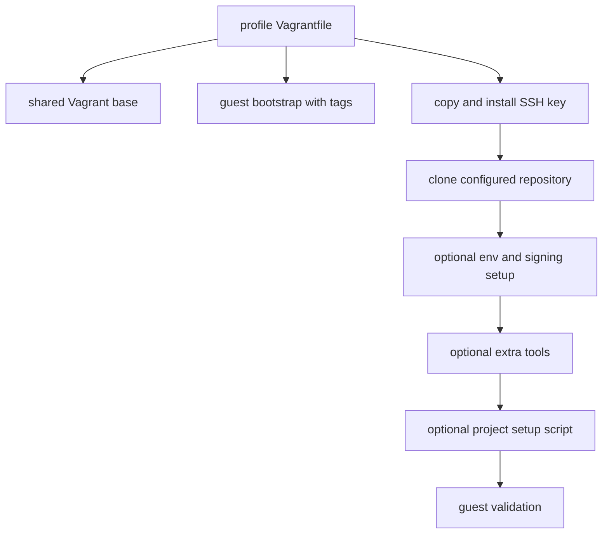

# Project VM Profile Provisioning

## Profile model

A profile is a `Vagrantfile` under [`dev vms/`](../../dev%20vms/) that loads the shared [`VagrantBaseFile`](../../ubuntu-autoinstall/vagrant-base/VagrantBaseFile), then adds guest-side file, shell, and reload provisioners. This makes VM infrastructure common while leaving a profile to declare its resource overrides, selected Ansible tags, target repository, and optional project setup.

Profiles **inherit lifecycle behavior from** [Ubuntu box and VM lifecycle](vm-lifecycle.md), including the `ubuntu-dev` box, SSH setup contract, networking, SPICE settings, and optional disk growth. Their selected tags in turn **dispatch into** the role catalog in [Provisioning architecture](../architecture/overview.md#ansible-role-catalog).

## Common guest sequence

The reusable scripts implement this progression:

1. `provision_01_install_bootstrap.sh` downloads the current root bootstrap script and runs it locally with `BOOTSTRAP_TAGS` (or its default tag set).
2. The profile copies the host SSH key pair to `/tmp`; `provision_02_setup_ssh_key.sh` moves it into the guest’s `~/.ssh` if a key does not already exist.
3. `provision_03_clone_git_repo.sh` clones the configured `REPOSITORY_NAME` into the guest home directory.
4. When configured, later scripts prepare an `.envrc`, set up Git/GPG signing, install additional tools, and run a project-specific setup script.
5. `provision_validate_setup.sh` checks for SSH material, a secret GPG key, and global Git identity/signing settings.

Profiles may insert reload provisioners where group membership or newly installed tooling needs a fresh session. The IBKR profile reloads after SSH setup and after its tool install, then performs a final restart.

*The common ordering is defined by reusable scripts, while each profile chooses which optional stages and tags it needs.*

## Profile examples

| Profile | Distinguishing configuration | Primary source |
| --- | --- | --- |
| `ibkr` | Bootstraps Doppler, Helm, Argo CD, kubectl, Python, dependencies, Docker, GitHub CLI, and Zsh; later installs MicroK8s, VS Code, .NET, Rider, and MongoDB Compass. Clones `interactivebrokers2`, creates environment configuration, runs a project setup script, and validates repository, `.envrc`, and TWS presence. | [`dev vms/ibkr/Vagrantfile`](../../dev%20vms/ibkr/Vagrantfile) |
| `portfoliozen` | Uses its own default Vagrant key path; bootstraps a developer stack including PostgreSQL, Postman, and Ruby, then adds VS Code, .NET, MicroK8s, Go, PostgreSQL, and Node.js. | [`dev vms/portfoliozen/Vagrantfile`](../../dev%20vms/portfoliozen/Vagrantfile) |
| `gpuenabled` | Adds PCI passthrough only when `LIBVIRT_GPU_PCI_DEVICES` contains validated PCI addresses; sets host-passthrough CPU mode, Q35, and hidden KVM when devices are supplied. | [`dev vms/gpuenabled/Vagrantfile`](../../dev%20vms/gpuenabled/Vagrantfile) |
| `test` and `gaspeep` | Smaller profile variants that share the same base and provisioning-script family. | [`dev vms/test/Vagrantfile`](../../dev%20vms/test/Vagrantfile), [`dev vms/gaspeep/Vagrantfile`](../../dev%20vms/gaspeep/Vagrantfile) |

The most recent profile-level Git change added `ruby` to PortfolioZen’s bootstrap tags, reinforcing that profile tool selection is localized rather than hardcoded in the shared VM base.

## Credential boundary

The profile pattern deliberately transfers the host’s `~/.ssh/id_ed25519` and public key into the guest. IBKR also forwards environment values used by its environment, GPG, and project setup stages. The repository never supplies these values; callers must provide their own environment configuration and should not record secret values in profile files or documentation.

This means a VM must be treated as trusted with access to that copied private key and with any injected secret-derived configuration. The separate host credential flow is optional and prompt-gated by the root bootstrap; its safety considerations are documented in the [Operations runbook](../operations/runbook.md#host-credentials-and-signing).

## Change impact

- Adding a profile should load the shared base and use the existing script sequence where its semantics fit; do not duplicate base networking or resize logic.
- Changing a reusable `provision_*.sh` script affects multiple profiles. Search its call sites before changing it.
- A new tag must exist in `main.yml`; a profile’s tag order has practical meaning only as the selected playbook role sequence remains centrally fixed.
- Validate both generic guest checks and profile-specific checks after changes; see [Testing and change guide](../testing-and-change-guide.md#profile-and-vm-validation).
