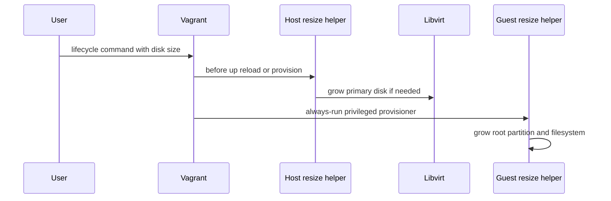

# Ubuntu Box and VM Lifecycle

## Build and register the base box

[`ubuntu-autoinstall/packer.pkr.hcl`](../../ubuntu-autoinstall/packer.pkr.hcl) builds a KVM-accelerated QEMU image from an Ubuntu ISO, uses the `ubuntu` SSH user and generated `vagrant_custom_key`, installs cloud-init input from `meta-data` and `user-data`, and packages the result with the Vagrant post-processor for the libvirt provider. The box name defaults to `ubuntu-dev`.

The companion [`ubuntu-autoinstall/bootstrap.sh`](../../ubuntu-autoinstall/bootstrap.sh) is the guarded build entrypoint. It checks tools such as Packer, Vagrant, `virsh`, and KVM access; verifies libvirt connectivity and the `vagrant-libvirt` plugin; can install missing host prerequisites using the root playbook; then prompts for guest password/key setup and drives the build. The repository’s build README directs users to add the generated metadata, not the raw archive:

```bash
cd ubuntu-autoinstall
./bootstrap.sh
vagrant box add output/ubuntu-dev.json
```

This workflow **depends on** the host tooling described in [Provisioning architecture](../architecture/overview.md#ansible-role-catalog), particularly `qemu`, `kvm`, `libvirt`, `virtmanager`, `packer`, and `vagrant`.

## Shared Vagrant contract

All normal profiles load [`ubuntu-autoinstall/vagrant-base/VagrantBaseFile`](../../ubuntu-autoinstall/vagrant-base/VagrantBaseFile). It defines `ubuntu-dev`, derives the VM hostname from the profile directory, configures the `ubuntu` SSH account, and requires `VAGRANT_CUSTOM_KEY_PATH` unless the profile sets a default. It configures KVM/libvirt defaults and transfers the host timezone into the guest.

The shared base **is extended by** the profile workflow in [Profile provisioning](profile-provisioning.md): profile `Vagrantfile`s add their own file and shell provisioners after loading the common file.

### Network selection and lifecycle

At `vagrant up`, the base attempts to activate and mark the `vagrant-libvirt` network for autostart when libvirt already has that network. It selects networking in this order:

1. an existing, active interface named by `VAGRANT_BRIDGE`;
2. an active Linux bridge, preferring `br0` while rejecting `virbr*` and `docker*`;
3. an active default-route uplink attached in libvirt direct bridge mode; or
4. a private DHCP network if no qualifying interface exists.

The logic complements—but does not require—the host `bridge` role. That role can create `br0` through NetworkManager; the high-impact behavior and removal path are in the [Operations runbook](../operations/runbook.md#host-networking).

## Resize an existing VM

Set a positive integer `VAGRANT_VM_DISK_SIZE_GB` before lifecycle commands:

```bash
export VAGRANT_VM_DISK_SIZE_GB=150
vagrant up --provider=libvirt
# For an existing machine, use one of:
vagrant provision
vagrant reload --provision
vagrant up --provision
```

The shared base validates the value, sets `libvirt.machine_virtual_size` for creation, and installs pre-action triggers for `up`, `reload`, and `provision`. The triggers run [`resize_libvirt_primary_disk.sh`](../../ubuntu-autoinstall/vagrant-base/resize_libvirt_primary_disk.sh) against the host’s primary libvirt disk. A privileged `run: always` guest provisioner runs [`resize_guest_root_fs.sh`](../../ubuntu-autoinstall/vagrant-base/resize_guest_root_fs.sh), which expands the root partition and supports LVM plus ext, XFS, and Btrfs layouts.



*The resize sequence is intentionally two-stage: host virtual-disk capacity is expanded before the guest attempts its root filesystem expansion.*

The helpers are growth-only; do not treat the variable as a shrink mechanism. This two-stage design was introduced in the May 2026 disk-resize change, which resolved the gap between provider disk sizing and an already-created guest filesystem.

## Graphics and guest display

The base uses SPICE, virtio video, and a SPICE agent channel. The base image installs `spice-vdagent`, so current rebuilt boxes can support display resizing through SPICE clients. Optional EGL/3D layout changes are not part of `vagrant up`; they are post-creation libvirt XML operations handled by the scripts in [`toolbox/libvirt/`](../../toolbox/libvirt/). Use the recovery instructions in [Operations runbook](../operations/runbook.md#graphics-and-gpu) if a graphics change prevents boot.

## Change impact

Changing the shared base changes every profile that loads it. Before altering it, inspect representative profiles such as `dev vms/ibkr/Vagrantfile`, `dev vms/portfoliozen/Vagrantfile`, and `dev vms/gpuenabled/Vagrantfile`; then perform the lifecycle checks in [Testing and change guide](../testing-and-change-guide.md).
